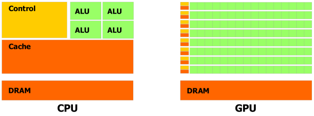

************
Introduction
************

What is a GPU?
**************

Modified from `The GPU Programming module <http://selkie.macalester.edu/csinparallel/modules/GPUProgramming/build/html/Introduction/Introduction.html>`_ by Libby Shoop and Yu Zhao.  

A Graphics Processing Unit (GPU) is an electronic circuit that uses rapid memory manipulation and massive parallel data processing to accelerate the building of images intended for output to a display. Right now, GPUs are used in almost all customer end personal computers, game consoles, professional workstations, and cell phones.

Before GPUs were introduced, CPUs did all the graphic processing tasks. In the early 1990s, computer manufacturers began to include GPUs into computer system with the aim of accelerating common graphics routines. After two decades of development, GPUs eventually outpaced CPUs as they actually have more transistors, are clocked faster, and have capability to do parallel computation more efficiently. GPUs these days have become so complex that they are basically computers in themselves, with their own memory, buses and processors. As GPUs harnessed more and more horsepower, GPU manufacturers (such as NVIDIA and ATI/AMD) found a way to use GPUs for more general purposes rather than just graphics or videos. This gave birth to the Compute Unified Device Architecture structure and CUDA C Programming Language, NVIDIA’s response on facilitating the development of General Purpose Graphics Processing Unit (GPGPU).

How do GPUs and CPUs differ?
****************************

GPUs and CPUs differ greatly, especially in that GPUs have highly parallel structures which make them work more effectively than CPUs if used on data that they can partition and process in parallel. 

CPUs and GPUs differ in computational capability because GPUs are specialized for compute-intensive and highly parallel computation in order to render graphics. CPUs will operate better in situations that require using large caches, which repeatedly read the same memory location. GPU caches only need to have enough space to store a few texture elements, so GPUs work better for sequential data processing than for data caching or flow control. Problems can have effective parallel solutions when: the same problem instruction? code? unit of code? arithmetic instruction unit? process? algorithm? needs to be executed for each element, which requires less sophisticated flow control; and when the problem has a massive dataset and high arithmetic intensity, which reduces the need for low latency memory. 

	    
	    This figured originally made for the NVIDIA CUDA Programming Guide.

The figure above shows the different between CPU and GPU in their structure. Cache is designed for data caching; Control is designed for flow control; ALU (Arithmetic Logic Unit) is designed for data processing. 

Transfering Data
****************

Modified from a book on the NVIDIA Developer's Zone website: `GPU Gems 2 <http://http.developer.nvidia.com/GPUGems2/gpugems2_chapter32.html>`_, by Ian Buck.

One final performance consideration when using the GPU as a computing platform is the issue of download and readback. Before we even start computing on the GPU, we need to transfer our initial data down to the graphics card. Likewise, if the results of the computation are needed by the CPU, we need to read the data back from the GPU. Performing the computation on the CPU does not require these extra operations. When comparing against the CPU, we must consider the performance impact of downloading and reading back data.

.. figure:: transfer.png
	    :align: center

	    Figure made by David Bunde.

Consider the example of adding two large vectors on the GPU. Executing a fragment program that simply fetches two floating-point values, adds them, and writes the result will certainly run faster than it would on a CPU implementation, for reasons explained earlier. However, if we add the cost of downloading the vector data and reading back the results to the CPU, we are much better off simply performing the vector add on the CPU. Peak texture download and readback rates for today's PCI Express graphics cards max out around 3.2 GB/sec. A 3.0 GHz Pentium 4 can add two large vectors at a rate of approximately 700 megaflops (millions of floating-point operations per second, or Mflops). [2] So before we could even download both of the vectors to the GPU, the CPU could have completed the vector addition.

To avoid this penalty, we need to amortize the cost of the download and readback of our data. For simulation applications, this is less of a problem, because most such algorithms iterate over the data many times before returning. However, if you plan to use the GPU to speed up linear algebra operators (such as vector add), make sure you are doing enough operations on the data to cover the additional cost of download and readback.

Warps and Threads
*****************

We also need to consider how the GPU will execute the code. CUDA systems run code in terms of warps, where each warp runs 32 threads. All threads in a warp will execute a single instruction at the same time, so that in the time to for one thread complete a single arithmetic operation, every other thread in the warp will also have completed one.

