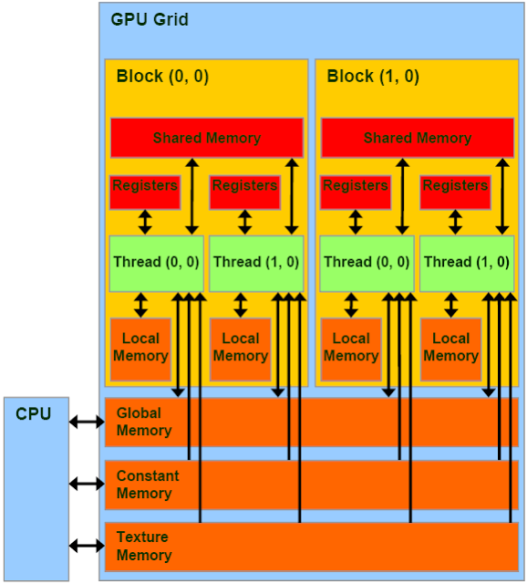

CUDA Architecture
=================

CPUs are designed to process as many sequential instructions as
quickly as possible. While most CPUs support threading, creating
a thread is usually an expensive operation and high-end CPUs can
only handle 8 threads efficently.

GPUs on the other hand are designed to process a small number of
parallel instructions on large sets of data as quickly as 
possible. For instance, calculate 1 million polygons and
determine which to draw on the screen and where. To do this they
rely on many slower processors and inexpensive threads.

Physical Architecture
#####################

CUDA cards are composed of one or more Streaming Multiprocessors 
(SMs). Each SM has a cache of shared memory that is faster than 
the GPUs global memory but that can only be accessed by that SM.
Streaming Multiprocessors are composed of several CUDA cores.
The exact numbers depend on your device, see the Finding your
Device Specifications sections for details. 

CUDA cores are grouped together to perform instructions on
a warp of threads. Warp simply means a group of threads and
all CUDA cards to date use a warp size of 32.
Depending on the model, the cores may be
double or quadruple pumped so that the execute one instruction
on two or four threads in as many clock cycles.
For instance, Tesla devices use a group of 8 quadpumped cores
to execute a single warp. If there are less than 32 threads in
the warp, it will still take as long to execute the instructions.

Virtual Architecture
####################

When programming in CUDA C we work with blocks of threads and
grids of blocks. What is the relationship between this virtual
architecture and the CUDA card's physical architecture?

When Kernels are launched each block in a grid is assigned to a
Streaming Multiprocessor. This allows threads in a block to use
``__shared__`` memory. If a block doesn't use the full resources
of the SM then multiple blocks may be assigned at once. If all of
the SMs are busy then the extra blocks will have to wait until a 
SM becomes free.

Once a block is assigned to an SM, it's threads are split into
warps by the warp scheduler and executed on the CUDA cores. 
Since all the same instruction is executed on each thread in the
warp simultaneously it's generally a bad idea to have
conditionals in kernel code.

Furthermore warps are always allocated the same way
if theads 0-31 are execute in a warp for one block, they will be
executed in the same warp for every block in the grid.

Because a warp's context (it's registers, program counter etc.)
stays on chip for the life of the warp, there is no additional
cost to switching between warps vs executing the next step of a 
given warp. This allows the GPU to switch to hide some of it's
memory latency by switching to a new warp while it waits for a
costly read.

CUDA Memory
###########

CUDA on chip memory is divided into several different regions

- **Registers** act the same way that registers on CPUs do, each 
    thread has it's own set of registers.

- **Local Memory** local variables used by each thread. They are
    not accesible by other threads even though they use the same
    L1 and L2 cache as global memory.

- **Shared Memory** is accessible by all threads in a block. It 
    must be declared using the ``__shared__`` modifier. It has a
    high bandwidth and low latency than global memory however if
    multiple threads request the same address the requests are
    processed serially which slows down the application.

- **Constant Memory** is read-accessible by all theads and must
    be declared with the ``__const__`` modifier. In newer devices
    there is a seperate read only constant caches.

- **Global Memory** is accessible by all threads. It's the
    slowest device memory, but on new cards, it is cached. Memory
    is pulled in 32, 64, or 128 byte memory transactions. Warps 
    executing global memory accesses attempt to pull all the data
    from global memory simultaneously therefore it's advantageous
    to use block sizes that are multiples of 32. If
    multidimensional arrays are used, it's also advantageous to
    have the bounds padded so that they are multiples of 32

- **Texture/Surface Memory** is read-accesible by all threads
    unlike Constant Memory, it is optimized for 2D spacial
    locality, and cache hits pull in surrounding values in both
    x and y directions.

    *CUDA Memory Hierarchy*
    *Image courtesy of NVIDIA*

Finding your Device Specifications
##################################

CUDA provides a program that prints out the specifications of
your device. To run it, execute this command:

``/usr/local/cuda/samples/1_Utilities/deviceQuery/deviceQuery``

If that doesn't work you probably need to build the samples

.. code-block:: bash
    
    cd /usr/local/cuda/samples/1_Utilities/deviceQuery
    sudo make
    ./deviceQuery

Look for the number of Multiprocessors on your device,
the number of CUDA cores per SM, and the warp size.
