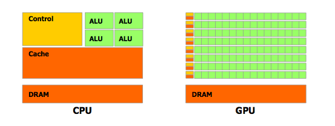

********************
Introduction
********************

Why CUDA?
-----------

To this day, commodity CPUs are only capable of running around 6 real simultaneous threads. GPUs, on the other hand, can support many hundreds of parallel threads. This unique compute paradigm allows massively parallel computations to be sped up drastically, enabling applications such as real-time weather prediction, kinetic modeling, or high-end graphics.

..

	*The GPU has much more space devoted to computation and less to control flow and cache.*

..

	Image source: *NVIDIA CUDA Programming Guide v. 4.0* (pg. 3)
CUDA was developed and released by NVIDIA in 2006. The goal of CUDA was to provide a standard general purpose computing architecture and instruction. All NVIDIA cards released since 2006 are CUDA enabled.

..

