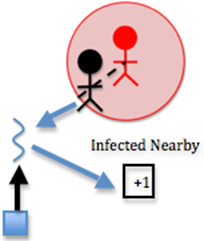

**************
CUDA Functions
**************

CUDA Global Variable
#####################

At any time, use of global variables outside of **main()** function is discouraged in C programming, mainly because it is really difficult to handle the scope of the program. However, as we are building a CUDA and MPI hybrid, **all** CUDA code need to be compiled with **nvcc** compiler, which means we need to separate CUDA code from other code. Normally, we should declare these variables inside cuda_t structure we initialized in **main()** function, but the problem is that MPI compiler **mpicc** or C compiler **gcc** or **icc** does not recognize the type curandGenerator_t, which forces us to declare global variable inside this file, which will eventually compiled by **nvcc**\.

**gen**

curandGenerator_t, which is effectively a random generator on CUDA device. A generator in CURAND encapsulates all the internal state necessary to produce a sequence of pseudorandom or quasirandom numbers. 

**current_time**

time_t, variable we use to hold the current time. We will use this as seed.

**rand_nums**

array, this is a pointer pointed to an array of random float numbers.

CUDA Device Functions
#####################

cuda_move()
***********
This is the CUDA implementation of the **move()** function in core functions chapter.

First, each thread randomly picks whether the person moves left or right or does not move in the x dimension.

.. literalinclude:: CUDA.cu 
    :language: c
    :lines: 36-38 

The code uses (int)(rand_nums[id]*3) - 1; to achieve this. rand_num is a array of random numbers generated before. All the random numbers in this array are floats between 0 and 1. Then, rand_nums[id]*3 will turn all the floats to numbers between 0 and 3. After this, we can cast all the floats to int, which eventually will make all the numbers as either 0, 1 or 2. Finally, we subtract 1 from this to produce -1, 0, or 1. This means the person can move to the right(1), stay in place (0), or move to the left (-1).

The thread randomly picks whether the person moves up or down or does not move in the y dimension. This is similar to movement in x dimension.

.. literalinclude:: CUDA.cu 
    :language: c
    :lines: 40-42

Next, we need to make sure the person remain in the bounds of the environment after moving. We check this by making sure the person’s x location is greater than or equal to 0 and less than the width of the environment and that the person’s y location is greater than or equal to 0 and less than the height of the environment. In the code, it looks like this:

.. literalinclude:: CUDA.cu	
    :language: c
    :lines: 46-49

Finally, The thread moves the person

.. figure:: img-20.png
   :align: center
   :alt: image

.. literalinclude:: CUDA.cu	
    :language: c
    :lines: 51-53

cuda_susceptible
****************

This is the CUDA implementation of the **susceptible()** function in core functions chapter.

If the person is susceptible,

.. literalinclude:: CUDA.cu	
    :language: c
    :lines: 95

For each of the infected people (received earlier from all processes) or until the number of infected people nearby is 1,

.. literalinclude:: CUDA.cu		
    :language: c
    :lines: 101

If this person is within the infection radius,

.. literalinclude:: CUDA.cu		
    :language: c
    :lines: 104-107

then, the thread increments the number of infected people nearby

.. literalinclude:: CUDA.cu		
    :language: c
    :lines: 110

This is where a large chunk of the algorithm's computation occurs. Each susceptible person must be computed with each infected person to determine how many infected people are nearby each person. Two nested loops means many computations. In this step, the computation is fairly simple, however. The thread simply increments the **num\_infected\_nearby** variable.

Note in the code that if the number of infected nearby is greater than or equal to 1 and we have **SHOW\_RESULTS** enabled, we increment the **num\_infection\_attempts** variable. This helps us keep track of the number of attempted infections, which will help us calculate the actual contagiousness of the disease at the end of the simulation.

.. literalinclude:: CUDA.cu     
    :language: c
    :lines: 114-118

Similar to **cuda_move()**, we also need random numbers in this function. The difference is that we need integers between -1 and 1 in **cuda_move()** function, but we need integers between 0 and 100 in this function. We obtain this random number using

.. literalinclude:: CUDA.cu	
    :language: c
    :lines: 120-121

where rand_nums is still an array of random floats between 0 and 1 and we can multiply it with 100 and cast it into a int.

If there is at least one infected person nearby, and a random number less than 100 is less than or equal to the contagiousness factor,

.. literalinclude:: CUDA.cu	
    :language: c
    :lines: 126

then, the thread changes this person’s state to infected

.. literalinclude:: CUDA.cu	
    :language: c
    :lines: 129

So far the code is similar to the **susceptible()** function executed on the CPU end. However, things get trickier from here. Since every threads need to update counters like **num_infected** or **num_susceptible** if someone is infected, we have racing conditions. In order to handle racing conditions and to maximize performance at the same time, we use both CUDA shared memory and CUDA atomic operations to update counters.

We use shared memory as temporary arrays to hold counters changed by each thread, then we reduce this array to a single number. Finally, we use CUDA atomic operations to add the number back to actual counter.

CUDA shared memory is cache assigned to each multiprocessor. In case some of you are not familiar with the concept of multiprocessor, you can think of multiprocessor as the physical phase of blocks in CUDA coding. A typical NVIDIA GPU card with Fermi architecture (perfectly fine if you don't know what this is) supports maximum 1024 active threads per multiprocessor. This means that you can run 1024 threads concurrently on each multiprocessor. The reason we usually chose 128, 256 or 512 threads per block is that we want each multiprocessor can host exactly 8, 4 or 2 blocks on it. 

However, even if we use 128 threads per block when we launch the device functions, we don't necessarily get 8 blocks per multiprocessor. Why? Because each multiprocessor has limited shared memory and registers available. GPU with Fermi architecture usually have 48KB of shared memory per multiprocessor, which means that if each block uses 8KB of shared memory, you can only initialize 6 blocks on each multiprocessor. For us, this is less of a concern because we only allocate four or five (later you will see why is four or five) arrays per block. Even we are using 1024 threads per block, we need maximum 5 * 1024 * sizeof(int) = 20KB, which is less than half of the shared memory available.

We first need to find out how many counters need atomic operations, in this function, there are four of them: **num_infected_dev**\, **num_susceptible_dev**\, **num_infection_attempts_dev** and **num_infections_dev**. This is important because we need to allocate enough memory when we invoke the device function calls. Since we have four counters that need atomic operations, we need to allocate four arrays, each having the length of the numbers of threads per block. The following line declares the shared memory:

.. literalinclude:: CUDA.cu 
    :language: c
    :lines: 20-21

This line suggests that we allocated an array of the data type int. However, it does not specify how long the array should be. Then, inside cuda_susceptible function, the following lines set up the four arrays we use for reduction.

.. literalinclude:: CUDA.cu 
    :language: c
    :lines: 78-84

we set the pointer of the first array as the pointer of the shared memory array. Then, we set the pointer of the second array as the pointer exactly **numThread** away from the pointer of the first array. We are essentially dividing the initial shared memory array into four equal sized arrays. 

After shared memory setup, we need to reset the shared memory. So each thread set its corresponding shared memory elements to zero at the very beginning of the function.

.. literalinclude:: CUDA.cu 
    :language: c
    :lines: 86-92

Again this is very important. Shared memory will not clear itself after use, and failing to clear shared memory before use usually meaning you are starting from what ever values the shared memory is left with from during last CUDA operations.

When we are updating counters, instead of adding one to or subtracting one from the actual counter located on device, in this case the **num_infected_dev** or **num_susceptible_dev**\ counter, we add one to or subtract one from the thread's corresponding array elements. 

.. literalinclude:: CUDA.cu 
    :language: c
    :lines: 110, 131-135

Finally, we need to add up the values in each array to obtain the final result. We do this using CUDA binary tree reduction. This is the official way to perform reduction operations in CUDA. The basic idea is that you create a half point on the array, use the first half threads to add the values of second half thread. This means that the array shrinks to one half of its original size. Then you can do another reduction, which will shrinks the array to one fourth of its original size. When the operation is done, the correct sum is stored at the first element of the array.The following is the implementation:

.. literalinclude:: CUDA.cu 
    :language: c
    :lines: 143-154

As you probably already see, one limitation of this operation is that the array size has to be the power of 2, which essentially meaning that the block size should be power of 2 as well. If we are dealing with problem size as large as tens of thousands even millions, this won't hurt us because we are always initializing 128, 256, 512 or even 1024 threads per block. However, if we are dealing with problem size as small as 50, things gets a little bit tricker.

Therefore, we put a if statement that checks whether the size of the block is power of 2 before we do any reduction operations. Such as:

.. literalinclude:: CUDA.cu 
    :language: c
    :lines: 142

if we indeed do not have some power of 2 many of threads in a block, we can use the **first thread** of the block to add all other entries in the array to the first element. 

.. literalinclude:: CUDA.cu 
    :language: c
    :lines: 160-169

The good news is that when we run into this problem, normally means that we are dealing with a very small problem size, which should not affect the performance significantly. Notice that we could use the first thread to add up the values even if we have 128 or 256 threads per block, but the reduction takes 127 or 255 steps. However, the binary tree reduction takes 7 or 8 steps to do the same. This will make our program run much faster.

Finally, the **first thread** update the actual counter with the first value of the array. However, we still face racing condition because more than one block could be updating the actual counter at the same time. CUDA designs functions like **atomicAdd** to handle situations like this, it can slow down your program significantly if you use **atomicAdd** too much, but since we are doing this once per block per counter, we do not suffer too much from performance loss. 

.. literalinclude:: CUDA.cu	
    :language: c
    :lines: 173-180

.. figure:: img-22.png
   :align: center
   :alt: image

Note in the code that if the infection succeeds and we have **SHOW\_RESULTS** enabled, we increment the **our\_num\_infections\_dev** variable. This helps us keep track of the actual number of infections, which will help us calculate the actual contagiousness of the disease at the end of the simulation.

cuda_infected
*************

This is the CUDA implementation of the **infected()** function in core functions chapter.

If the person is infected and has been for the full duration of the disease, then

.. literalinclude:: CUDA.cu  
    :language: c
    :lines: 221

Note in the code that if we have **SHOW\_RESULTS** enabled, we increment the **num\_recovery\_attempts\_dev** variable. This helps us keep track of the number of attempted recoveries, which will help us calculate the actual deadliness of the disease at the end of the simulation.

.. literalinclude:: CUDA.cu  
    :language: c
    :lines: 223-225

After this, if a random number less than 100 is less than the deadliness factor, 

.. literalinclude:: CUDA.cu  
    :language: c
    :lines: 227-228

then, the thread changes the person’s state to dead

.. literalinclude:: CUDA.cu  
    :language: c
    :lines: 234-235

and then the thread updates the counters

.. literalinclude:: CUDA.cu  
    :language: c
    :lines: 236-238

.. figure:: img-23.png
   :align: center
   :alt: image

This step is effectively the same as function susceptible, considering deadliness instead of contagiousness. The difference here is the following step:

if a random number less than 100 is less than the deadliness factor, the thread changes the person’s state to immune

.. literalinclude:: CUDA.cu  
    :language: c
    :lines: 245-246

and then thread updates the counters

.. literalinclude:: CUDA.cu  
    :language: c
    :lines: 247-249

.. figure:: img-24.png
   :align: center
   :alt: image

If deadliness fails, then immunity succeeds.

Note in the code that if the person dies and we have **SHOW\_RESULTS** enabled, we increment the **num\_deaths\_dev** variable. This helps us keep track of the actual number of deaths, which will help us calculate the actual deadliness of the disease at the end of the simulation.

Note that the reduction process is the same as the **susceptible_cuda()** function, which involves shared memory reduction and CUDA atomic operations. The only difference is that we have five counters to reduce instead of four. This will be reflected when we assign shared memory space for each block.

cuda_update_days_infected()
***************************

This is the CUDA implementation of the **update_days_infected()** function in core functions chapter.

If the person is infected, then

.. literalinclude:: CUDA.cu  
    :language: c
    :lines: 312

Increment the number of days the person has been infected

.. literalinclude:: CUDA.cu  
    :language: c
    :lines: 315

.. figure:: img-25.png
   :align: center
   :alt: image

CUDA Host Functions
###################

cuda_init()
***********

This function will setup the CUDA runtime environment. 

Since we are allocating lots of arrays on the CUDA device memory, we first need to find out the size of each array. In total we need six arrays, of which **their_infected_x_locations_dev** and **their_infected_y_locations_dev** should be as long as the **total_number_of_people**, and the rest four arrays should have length as **our_number_of_people**. Note that of the four arrays above, **our_states_dev** is different from the rest because it holds char instead of int, which means we have to assign different size to it. The following line sets sizes we want.

.. literalinclude:: CUDA.cu  
    :language: c
    :lines: 325-328

After setting up the sizes, we can allocate arrays on the device. Note that all the pointers are already initialized in the cuda structure.

.. literalinclude:: CUDA.cu  
    :language: c
    :lines: 331-337

Besides arrays, we also need in allocate spaces for the eight counters in our structure and stats structure.

.. literalinclude:: CUDA.cu  
    :language: c
    :lines: 338-349

After allocating structure, we need to set up the random number generator. Since all the device code are executed on GPU device instead of on CPU, functions like **random()** will not work. Therefore, we need to use `NVIDIA cuRAND`_ library to generate all the random numbers. According to the documentation of cuRAND library, the normal sequence of operations to generate random number for CUDA device can be divided into seven steps. **cuda_init()** function will cover three steps, **cuda_run()** function will cover three steps, and **cuda_finish()** function will cover the last step.

1. Create a new generator of the desired type with curandCreateGenerator().

.. literalinclude:: CUDA.cu  
    :language: c
    :lines: 351-352

2. Set the generator options; for example, use curandSetPseudoRandomGeneratorSeed() to set the seed.

.. literalinclude:: CUDA.cu  
    :language: c
    :lines: 353-356

3. Allocate memory on the device with cudaMalloc().

.. literalinclude:: CUDA.cu  
    :language: c
    :lines: 357-358

After generating random numbers, we need to set up block size and grid size for CUDA operations. Since the primary data type of our program is array, we can initialize only 1-D array for CUDA device functions. 

Since the primary test machine for this module is `LittleFe`_, which features NVIDIA ION Graphics (ION2), we set the block size to be 256 threads per block as the maximum active threads per multiprocessor on ION Graphics (Compute Capability 1.3) is 512. However, if you have GPU cards that are more advanced (Compute Capability 2.0+), you can set the block size to 512, 1024 or even 2048.

.. literalinclude:: CUDA.cu  
    :language: c
    :lines: 362

Further, if we have less than 256 people in our simulation, we initialize exactly number of people many of threads.

As for grid size, we decide grid size according to our simulation size. For example, if you have 1000 people in your simulation, program will initialize 4 blocks.

.. literalinclude:: CUDA.cu  
    :language: c
    :lines: 363

cuda_run()
**********

This function will execute the CUDA device functions.

We first use **cudaMemcpy()** to copy data on host memory to device memory. Since all of the code only performs one day's simulation, we need to put **cuda_run()** function inside a loop. One could call all the **cudaMemcpy()** functions in each iteration, or we could divide them into two categories, those that requires constantly communicating with CPU and those who do not.

After careful examination of the code, it is not hard to find out that some functions, especially MPI functions, on host end need **their_infected_x_locations** and **their_infected_y_locations** to share infected information to all other nodes. They also need these arrays to do display. Therefore, in every iteration, we need to copy these two arrays to device and copy then back to host after execution. However, other arrays or counters can reside on card from start to finish without re-copy from host to device. Therefore, we implement **cudaMemcpy()** functions in the following fashion,

.. literalinclude:: CUDA.cu  
    :language: c
    :lines: 373-407

where **if(our->current_day == 0)** makes sure that most of the data only gets copied in the first iteration, instead of in every iteration.

Another thing you probably noticed is that we cast stats counters to int before sending them to the device memory. 

.. literalinclude:: CUDA.cu  
    :language: c
    :lines: 397-400

This is because that variables in stats structure are initialized as doubles, but CUDA atomic operations prefer integer. Since we always perform integer operations on stats counters (either add one or subtract one), we can first cast them into int, and we can later cast them back to double after device function's execution.

After the copying the data, we need to generate the random numbers. Recall that we performed the first three steps of the seven steps CUDA random number generation process, the next step, or the fourth step is:

4. Generate random numbers with curandGenerate() or another generation function.

.. literalinclude:: CUDA.cu  
    :language: c
    :lines: 412

Notice that we are generating twice many of total people number of random numbers. This is because the next device function call is **cuda_move()**, which moves every person in both x direction and y direction.

Then, we can call device functions from host:

.. literalinclude:: CUDA.cu  
    :language: c
    :lines: 414-459

Most of the device function calls are straight forward, however, two things needed to be pointed out. First is that we perform the 5th step and 6th step of CUDA random number generation process in between, which are

5. Use the results.

6. If desired, generate more random numbers with more calls to curandGenerate().

Another thing is that when calling **cuda_susceptible()** and **cuda_infected()** functions, we passed a third argument other than **numThread** and **numBlock** to the device function.

.. literalinclude:: CUDA.cu  
    :language: c
    :lines: 430, 446

The third parameter is the size of the shared memory, which depends on how many counters we need to reduce in each function.

Finally, we need to copy device data back to host. However, just like when we copy data from host to device, we need to differentiate data that needs to be copied in every iteration and those that needs to be copied only once. In this case, we need to copy arrays **our_x_locations**, **our_y_locations** and **our_states** back to host memory. This is because MPI functions will need them to perform **Allgather()** and **Allgatherv()** operations. We also copied counter **our_num_infected** back because we need it in other functions as well.

As for other arrays or counters, we can copy them back in the last iteration. Notice that we never copy **our_num_infected_days** array back to host memory, this is because non of the host functions need this array.

.. literalinclude:: CUDA.cu  
    :language: c
    :lines: 461-489

cuda_finish()
*************

This function will finish the CUDA environment.

After allocating all the arrays and counters on GPU device memory, we need to free them.

.. literalinclude:: CUDA.cu  
    :language: c
    :lines: 499-510

Further, the last step of CUDA random number generation process is:

7. Clean up with curandDestroyGenerator().

.. literalinclude:: CUDA.cu  
    :language: c
    :lines: 520-523

.. _NVIDIA cuRAND: http://docs.nvidia.com/cuda/curand/index.html
.. _LittleFe: https://littlefe.net/parts-v4