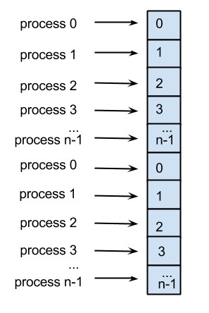

*****************************
Dividing Large Sized Problems
*****************************

The splitting of a large sized problem can be done in various ways, some of which have become standards and are repeatedly used in various problems. Depending on the kind of computation used to solve a problem, one way of iterating over data may be preferred over the other. Naturally the easiest solution would be to split the data into approximately equal parts amongst computer nodes or processor cores. This, however, may not always be the most efficient approach. Therefore, it is necessary to know some commonly used techniques for splitting up data. 
We introduce two parallelization methods widely applied to parallelized loops: **blocking** and **striping (or slicing)**. 

Blocking is a way of dividing data into adjacent equally sized chunks. Then each of these chunks is assigned to each processing unit or core. The following illustration depicts dividing an array of data into n blocks and assigning each block to one of the *n* processes. The block sizes are approximately the same, depending on whether the amount of data is divisible by the number of processes. 

.. image:: blocking.png
	:width: 900px
	:align: center
	:height: 290px
	:alt: blocking

.. note:: Blocking is ideal in cases of uniform distribution of data and preferable when loop iterations access memory/cache locations. 

Striping is a way of iterating over data such that the processes and/or cores seemingly alternate between iterations. For instance, the first iteration will be performed by the first process, the second iteration by the second process, the third iteration by the third process, and so on. If there are *n* processes then each processor will perform every *n*th iteration. The following illustration shows this method.

This pattern continues until we’ve iterated over all data. The size of each strip can vary. 

.. note:: Striping as a method is desirable in case of non-uniform data distribution and when loop iterations do not access memory/cache locations.

In case of hybrid computing we can perform blocking amongst processes as well as further apply blocking on dividing data amongst threads. Same applies for striping. Combinations are also possible such as blocking first and then striping, or striping first and then blocking.