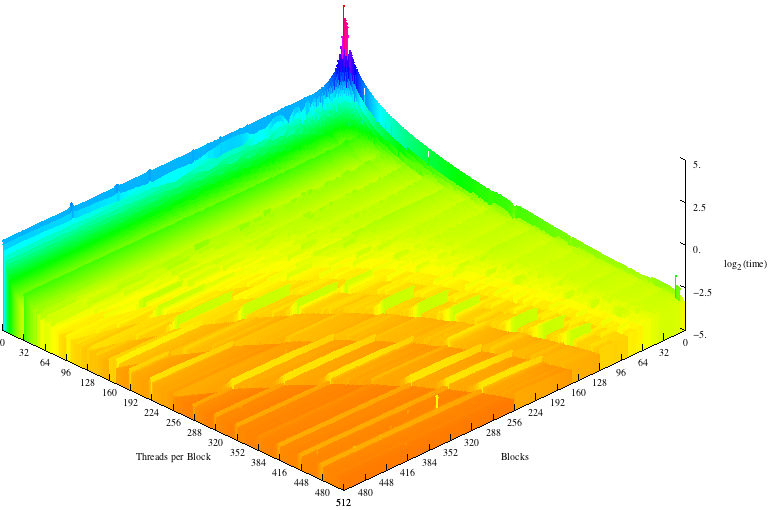

Choosing the right Dimensions
=============================

.. sidebar:: Compute Capability

    The compute capability of a CUDA card designates what features are available.
    The `Wikipedia CUDA page <http://en.wikipedia.org/wiki/CUDA>`_ provides an overview
    of various cards and their compute capability, along with the features available with that compute capability.
    
One of the most important elements of CUDA programming is
choosing the right grid and block dimensions for the 
problem size.  Early CUDA cards, up through compute capability
1.3, had a maximum of 512 threads per block and 65535 blocks in
a single 1-dimensional grid (recall we set up a 1-D grid in this code).  In later
cards, these values increased to 1024 threads per block and 2\ :sup:`31` - 1 blocks in a grid.

It's not always clear which dimensions
to choose so we created an expiriment to answer the following
question:

*What effect do the grid and block dimensions have 
on execution times?*

To answer this question, we wrote a 
:download:`script <testMandelbrot.sh>` to run our mandelbrot code
for every 
grid size between 1 and 512  blocks and every number of threads 
per block between 1 and 512 which produced 262,144 data
points. We chose these ranges because our madelbrot set picture is
512x512, so each thread will calculate the value of at least
one pixel at the largest value of each.

The device we ran the tests on was a Jetson TK1 which is
a Kepler class card that has
one Streaming Multiprocessor with 192 CUDA cores. To ensure
that our code was the only thing running on the GPU, we
first disabled the X server.

Results
#######

This is a 3D graph of our :download:`results <results.txt>`
where the z axis is the
log\ :sub:`2`\ (time) we took the log so that all results
fit neatly on the graph.

There are a number of interesting things to note about this
graph:

- Trials with one block and many threads are faster than
  trials with many blocks of one thread each.

- There are horizontal lines indicating a spike in execution
  time after every 32 threads per block

- 512 threads per 512 blocks was the fastest execution time

- There are convex lines running through the middle of the 
  graph

Each of these observations relates directly to CUDA's
architecture or the specifics of the code. 

Many threads in 1 block is always faster than many blocks of
one thread because of the way threads are put into warps.
The Jetson can execute 4 warps simultaneously. This means that
when the number of threads/block is one only 4 threads can run concurently
but when the number of blocks is one and there are many threads per block,
the threads can be evenly divided
into warps so that up to 128 are being run simultaneously.

Warp size also explains the horizontal lines every
32 threads per block. When block are are evenly divisible
into warps of 32, each block uses the full resources of the
CUDA cores on which it is run, but when there are (32 * x) + 
1 threads, a whole new warp must be scheduled for a single
thread which wastes 31 cycles cycles per block.

512x512 is the fastest execution time even though the GPU
can't run that many threads at a time. This is because 
it is inexpensive to create threads on a CUDA card and having
one pixel per thread allows the GPU to
most efficently schedule warps as the CUDA cores become free.
Additionally, since accessing the color data takes time, the
GPU can help us out by calculating other warps while waiting
for the read to finish.

The convex lines appear for a few different reasons. The
first has to do with our code. When the picture is evenly
divisible by the total number of threads and blocks, each 
thread performs the same amount of work so the warps aren't 
bogged down by the threads that calculate the extra pixels.
Second, when block and grid dimensions are about roughly 
equal, the block and warp schedulers share the work of 
dividing the threads.

Adding More Streaming Multiprocessors
#####################################

We executed our code again on a GeForce GTX 480 card that 
has 15 SMs with 32 CUDA cores each. 

.. figure:: Dev0Medium.png
    :align: center
    :figclass: align-center
    :width: 768
    :height: 510
    :alt: Execution time

This graph also features horizontal lines at multiples of 
32 coresponding to the warp size, concave lines, and a top
execution speed at 512x512. However there are 2 important
differences.

First, one block of many threads and many blocks with one
thread each take about the same amount of time to execute.
Because this card uses the Fermi architecture, each SM can run
two warps concurently, this means that 64 threads can be running
at any given time. While still not as fast as using one block,
many blocks is significantly faster with multiple SMs.

The second difference is a series of valleys running 
perpendicular to the warp lines about every 15 blocks.
These valleys come from the way blocks are distributed
between the SMs. When the block size is a multiple of the
number of SMs, each processor will do the about same
amount of work. However, as the number of blocks increases
this difference becomes less and less important because
the blocks don't all take the same amount of time to execute
and so it's possible for three blocks to execute on one SM
in the time it takes for another to execute 2.

CUDA best practices
###################

From these results we can draw up a list of best practices:

#. Try to make the number of threads per block a multiple of 32.

#. Keep the number of threads per block and the number of blocks as close to equal as you can without violating the first tip.

#. Keep the amount of work each thread does constant, it's inefficent to have one thread perform calculations for two pixels while the rest only calculate one.

#. When in doubt use more threads not less, creating threads is inexpensive.

#. In general avoid having threads that do extra work or have conditionals.

#. Try to have a block size that is a multiple of the numberof SMs on your device, this is less important than the other tips.

