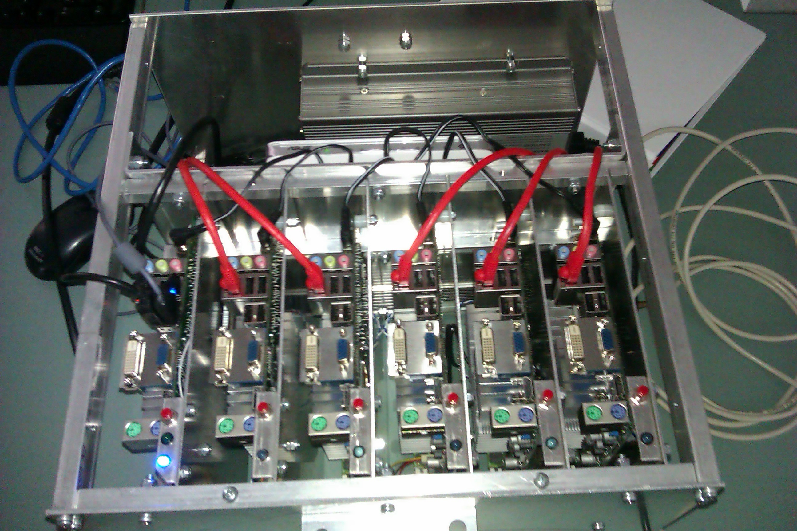

============================
Local Cluster Configurations
============================

There are two local clusters at Macalester College, one is Selkie, and the other is LittleFe. Here we want to give you a sense of how the two clusters work.

LittleFe
--------
LittleFe is a 6-node distributed memory cluster. Each node is a motherboard consists of a CPU, I/O devices, and memory .etc. It uses Message Passing Interface (MPI) library to distribute the task to each node, and let each node work their own task simultaneously. Then we can combine the result from each node to get the overall output. Each node of LittleFe has nVidia GT 218 GPU, which enables LittleFe to do GPU programming, CUDA C. All the nodes connect via the network router.

LittleFe is Linux-based operating system, which is provided by Bootable Cluster CD (BCCD). BCCD also provides some cool applications that can be run using MPI such as GalaxSee, Life, and Parameter-space, etc. Because of LittleFe's ability, we have also been working on Heterogeneous programming model, which combines both CUDA and MPI. You will see in the next module. In this module, we will be using LittleFe for our MPI programming activities. Below is a picture of LittleFe.

.. centered:: Figure 1: LittleFe

Selkie
------

Selkie is a virtual cluster, which was built in summer 2011, at Macalester College by a computer science summer research group. Selkie currently consists of VMs running on 44 iMacs in the computer lab. Those iMacs machines are quad-core models, with 8 GB of RAM. Since these iMacs are used for other purposes as well, virtual machines have been set up as the guest operating system that is run inside a host operating system.  We used VirtualBox for virtual machines because VirtualBox runs on Mac OS X, and it is open source. The operating system configuration on each virtual machine is Ubuntu linix Server version 10.04. Each virtual machine uses 2 CPU cores and 4 GB of memory.

.. topic:: Recommended Reading:

	* To read more on `Selkie Cluster <http://delivery.acm.org/10.1145/2160000/2157287/p517-shoop.pdf?ip=141.140.157.214&acc=ACTIVE%20SERVICE&CFID=96092423&CFTOKEN=89662159&__acm__=1342713644_7bcc228288bf005238f39f12e3a781c7>`_

How to log in onto your local clusters
^^^^^^^^^^^^^^^^^^^^^^^^^^^^^^^^^^^^^^

Your instructor will provide the instructions of how to log in onto your local clusters.

