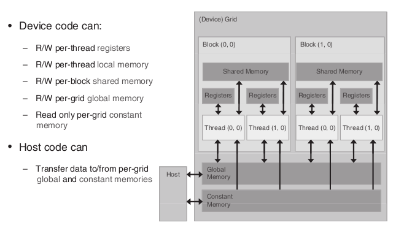
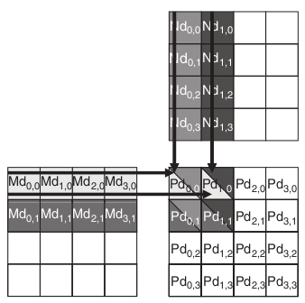
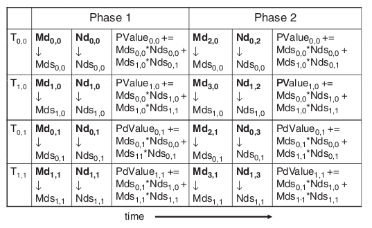

*********************
CUDA in Two-dimension
*********************

Acknowledgement
###############

The examples used in this chapter are based on examples in `Programming Massively Parallel Processors: A Hands-on Approach`_, written by David B. Kirk and Wen-mei W. Hwu, and published by Morgan Kaufmann publishers.

Copyright 2010 David B. Kirk/`NVIDIA Corporation`_ and Wen-mei Hwu. Published by Elsevier Inc.  All rights reserved. 

This copy of code is a derivative based on the original code and designed for educational purposes only. It contains source code provided by the book above.

.. _`Programming Massively Parallel Processors: A Hands-on Approach`: http://www.elsevierdirect.com/morgan_kaufmann/kirk/

.. _NVIDIA Corporation: http://www.nvidia.com

An Example of Matrix Multiplication
###################################

Starting from next chapter, we will learn more about GPU computing on multi-dimensional problems and really experience the advantage of GPU computing over CPU computing. Before we proceed to the next chapter, this chapter will introduce a Matrix Multiplication program that is written in standard C and use only CPU for the computation. We hope the result we obtain in this chapter can serve as a baseline for following chapters and provide a clearer view on how fast GPU computing can be.

CPU Matrix Multiplication Program source file: 
:download:`MM-CPU.c <MM-CPU.c>`

Performance
***********

We conducted 5 tests and the results are below.
 * 1. 41045.35 ms
 * 2. 40277.44 ms
 * 3. 40369.30 ms
 * 4. 40385.85 ms
 * 5. 40446.14 ms
 * Average: 40504.82 ms

==================================================================================================

Global Memory Version
#####################

Starting from this example, we will look at the how to solve problem in two-dimensional domain using two-dimensional grid and block. As we know, threads can be organized into multi-dimensional blocks and blocks can also be organized into multi-dimensional grid. This feature in CUDA architecture enable us to create two-dimensional or even three-dimensional thread hierarchy and solve two or three-dimensional problems more easily and more efficient. 

In this example, we will do the Square Matrix Multiplication. Two input matrices of size Width x Width are M and N and the output matrix is P with the same size. If you have learned linear algebra before, you will know that the output of two square matrices multiplied together is a square matrix of the same size. For example, to calculate entry (A,B) in the output matrix, we need to use row A in one input matrix and column B in another input matrix. We first take the left most element in row A and multiply it by top element in column B. Later, we take the second left element in row A and multiply it by second top element in column B. We do this for all the elements in row A and column B, and then we get the sum of products. The results will be the value at entry (A,B). As you can see, this kind of operation is highly paralleled, make it perfect for us to use CUDA. We do this by assigning each entry in output matrix a thread of its own. This thread will fetch the data and do all the calculations. It will later on write back the result to the out put matrix.

Matrix Multiplication with Global Memory source file: 
:download:`MM-GPU-GM.cu <MM-GPU-GM.cu>`

The Device Code
***************

.. literalinclude:: MM-GPU-GM.cu	
    :language: c
    :lines: 36-51

This is the complete device code.

.. literalinclude:: MM-GPU-GM.cu	
    :language: c
    :lines: 38-41

The 4 lines of code will assign index to the thread so that they can match up with entries in output matrix. As you may notice, we introduced a new CUDA built-in variable **blockDim** into this code. **blockDim** has the variable type of dim3, which is an 3-component integer vector type that is used to specify dimensions. This variable contains the dimensions of the block, and we can access its component by calling blockDim.x, blockDim.y, blockdIM.z.

Each thread in one specific block is identified by threadIdx.x and threadIdx.y. Each block is one specific grid is identified by blockIdx.x and blockIdx.y. Therefore, if we have threadIdx.x, threadIdx.y, blockIdx.x and blockIdx.y, we can locate one specific thread. 

The Host Code
*************

.. literalinclude:: MM-GPU-GM.cu	
    :language: c
    :lines: 74-76

The 3 lines of code above is declaring and initializing dim3 variables which give the grid dimensions and block dimensions. In each of the initializations, we only passed two parameters as components. The CUDA runtime will initialize any component left unspecified to 1. So technically, we are initializing dimBlock as (32, 32, 1) and dimGrid as (Width/32, Width/32, 1).

The rest of the host code is similar to examples we have seen before. Here is the complete version of the host code.

.. literalinclude:: MM-GPU-GM.cu	
    :language: c
    :lines: 4-34, 53-97 

Performance
***********

In the very top of the source file you can define the size of the matrix. Just change the Width definition to some number you like. While testing the performance, we used 1024 as Width same as the number used in the CPU baseline program. We conducted 5 tests and the results are below.
 
 * 1. 52.5 ms
 * 2. 52.4 ms
 * 3. 52.4 ms
 * 4. 52.4 ms
 * 5. 52.6 ms
 * average: 52.46 ms

Compared the CPU program, our GPU program is **772** times faster.
 
=============================================================================================================

CUDA Memory Types
#################

The reason CUDA architecture has many memory types is increasing the memory accessing speed so that data transfer speed can match data processing speed.The following example will show you why matching these two speeds is so important to GPU computation. 

One of the most important standards of a processor's computation ability is its flops_ computation. We assume that in order to perform one floating point operation, the runtime need to transfer one single-precision floating-point from global memory datum to the computational kernel. With this in mind, we can proceed to our example. 

The nVidia `Tesla C2075`_ companion processor supports 144 gigabytes per second (GB/s) of global memory access bandwidth. With 4 bytes in each single precision floating-point datum, we can load no more than 36 (144/4) giga single precision data per second. Since the computational kernel cannot compute more floating-point than the amount global memory has loaded, it will execute no more than 36 gigaflops per second. The actual kernel computational capability of our tesla card is 1 teraflops (1000 gigaflops) per second, but due to limited memory accessing speed, we can only achieve less than 4 percent of the actual speed. In other words, the highest achievable floating-point calculation throughout is limited by the rate at which the input data can be transfered from global memory to computational kernel.

To address this problem, CUDA architecture designed several types of memory that could potentially speed up the data loading process. We will see how use them in later examples. For now, we first need to know specifications of different memory types.

     
    This figure is from the website http://www.elsevierdirect.com/v2/companion.jsp?ISBN=9780123814722, originally found in the book `Programming Massively Parallel Processors: A Hands-on Approach`_. 

There are in total 4 types of memory designed for GPU cards with CUDA architecture. Global memory, located in the gird, has large storage capacity but limited speed, and can be read and write from all the blocks within CUDA system. Shared memory, located in each block, has small storage capacity (16KB per block) but fast accessing speed, can be read and write by all the threads within the located block. Constant memory, also located in the grid, has very small storage capacity (64KB per GPU) but very fast accessing speed, and can read (can't write) from any threads. There is also local memory located in each thread.

.. csv-table:: CUDA Memory Types
   :header: "Memory", "Scope of Access", "Lifetime", "R/W ability", "Speed" , "Declaration"
   :widths: 30, 60, 30, 40, 30, 70

   "Register", "Thread", "Kernel", "R/W", "Fast", "Automatic Variables"
   "Local", "Thread", "Kernel", "R/W", "Fast", "Automatic Arrays"
   "Shared", "Block", "Kernel", "R/W", "Fast", "__shared__"
   "Global", "Grid", "Host", "R/W", "Slow", "__device__"
   "Constant", "Grid", "Host", "Read only", "Fast", "__constant__"

.. _flops: http://en.wikipedia.org/wiki/FLOPS

.. _Tesla C2075: http://www.nvidia.com/docs/IO/43395/NV-DS-Tesla-C2075.pdf

==================================================================================================

Shared Memory Version
#####################

Matrix Multiplication with Shared Memory source file: 
:download:`MM-GPU-SM.cu <MM-GPU-SM.cu>`

Why we need a shared memory version? We already seen hundreds of times speed improvement.

Well, to answer that question, we need to first look at the relationship between global memory and our program. That is, in order to finish the matrix multiplication, how many times each element in matrix is accessed in the global memory? 

First, we have in total *Width x Width* many of threads and each thread computes one element of the output matrix. Then, let's take a closer look at each thread. For example, thread with the threadIdx of (x,y) will computes the element in the x column and y row of the output matrix. In order to do this, thread (x,y) have to access elements in row x of matrix M and elements in column y of matrix N. How about thread (x,y+1)? This time kernel will have to access row x in matrix M again and a different column y+1 in matrix N. What about thread (x,y+2) or (x+1,y)? It is not hard for you to find out that we accessed each row in matrix M the *Width* times and each column in matrix N the *Width* times as well. If we can reduce the access time to once for every row in matrix M and once for every column in matrix N, we can not only save bandwidth, but also increase performance significantly. 

Notice that although we say we want the kernel to access each row in matrix M and each column in matrix N once from global memory, we are not saying that the kernel access data once throughout the program. As we can see from previous sections, global memory has large capacity but low access speed. What we want is to transfer data from global memory to another type of memory which has fast access speed. The kernel still need to access same row or same column many times in that memory location, but this will significantly improve performance.

Upon this point, it may occur to you that shared memory is the ideal candidate for such task for it can access data faster than global memory. However, shared memory also has the drawback of small storage capacity. In the case of matrix multiplication, we can't just store the whole matrix into the shared memory. Remember that shared memory only has 48kB storage space per block, which is not large enough for some gigantic matrices. We solve this problem by managing shared memory in a dynamically way.

In the previous example, we assigned *Width x Width* many of threads for the computation where each thread will read one row of input matrix M and one column of input matrix N and computes the corresponding element in output matrix P. Although we use multiple blocks in a grid and multiple threads in a block, we don't see how threads are cooperating in the previous example. If we are allowed to assign infinite number of threads in one block, we can use just one block for the previous example. In this example, however, we will instruct all threads within one block to cooperate.

     
    This figure is from the website http://www.elsevierdirect.com/v2/companion.jsp?ISBN=9780123814722, originally found in the book `Programming Massively Parallel Processors: A Hands-on Approach`_. 

In order to make the problem easier, we use two 4x4 matrices for illustration. We set the size of block as 2x2, which in total has 4 threads. Therefore, the output matrix will have 4 blocks. As shown in the **graph** above, each element of the output matrix is marked by Pd(x,y) where x is the column number and y is the row number. Lets take a look at the block which has element Pd(0,0),Pd(1,0),Pd(0,1) and Pd(1,1). 

As you can see from graph, to compute four elements in this block, we need not only to access the corresponding block in input matrix M and input matrix N, but also the block to right of the corresponding block in matrix M and the block below the corresponding block in matrix N. That is in total 4 blocks of data need to be loaded. What if the maximum capacity of shared memory per block can only hold 2 blocks of data? 

The solution is simple. All threads within a block can first collaborate together to load some portion of data from global memory. This can be easily done by every thread in the block load one element from both input matrices into shared memory. In our example, thread(0,0) loads Md(0,0) and Nd(0,0); thread(1,0) loads Md(1,0) and Nd(1,0); thread(0,1) loads Md(0,1) and Nd(0,1); finally threads(1,1) loads Md(1,1) and Nd(1,1).Then we use these data to do some computations in each thread even though this is enough to give the final results. We can always let each threads to remember the running sum. After the computation, We can delete the data in shared memory because we do not need them any more. Actually, you don't even need to *delete* them, you can just load new data into it and old data will be erased automatically.

Then we can load more data from global memory to shared memory. This time, however, we cannot have each thread in the block load corresponding elements in input matrices. In our example, thread(0,0) loads Md(2,0) and Nd(0,2); thread(1,0) loads Md(3,0) and Nd(1,2); thread(0,1) loads Md(2,1) and Nd(0,3); finally threads(1,1) loads Md(3,1) and Nd(1,3). We can use this data for further computations. By the time we finished loading all the data to the shared memory from global memory, all the threads would have final results in the running sums. This way, we can use shared memory to increase the speed but not suffer from the limited storage capacity.

     
    This figure is from the website http://www.elsevierdirect.com/v2/companion.jsp?ISBN=9780123814722, originally found in the book `Programming Massively Parallel Processors: A Hands-on Approach`_. 

We call each data loading and computing process a phase. Therefore, in the previous example, we went through 2 phases before we have our final results. It is not hard to find out that by using shared memory, we can reduce the number if times of accessing global memory from *Width* times for every column or row to *Width/blockDim* times. 
1756.50
Back to our problem, we are dealing with input matrices with the size of *1024 x 1024* and we are using blocks with the size of *32 x 32*. We can potentially reduce the global memory accessing time to 1/32 of the original.

The Device Code
***************

.. literalinclude:: MM-GPU-SM.cu	
    :language: c
    :lines: 38-66

With all the explanations before, you should understand this device code easily.

If you are careful enough, you may see that I used a variable called **blockD**. This variable was defined at the very beginning of the source code.

.. literalinclude:: MM-GPU-SM.cu	
    :language: c
    :lines: 4

There are two thing you need to pay attention when defining this variable. First is that you should not assign this variable with a number that is too big. This variable is used to define the dimension of each block. The reason we are using block is to reduce the size of data transfer between global memory and shared memory every time. If you assign too big a number to it, you are risking running out of share memory. 

Another thing is that some of you might wonder why we are using *blockD* to represent block dimension instead of using blockDim. Well, blockDim is a built-in function used by CUDA C, you can define blockDim as a constant in here, but the built-in function will fail if you call it since you define a function equals a constant. The point I am trying to make here is that be very careful when you are choosing your variable names. CUDA C, different from standard C, has more built-in functions and you might bump into one or two while you are naming variables.

About blockDim and matrix dimension
***********************************

Another thing needs mentioning is that while choosing the value of *blockD*, it is crucial for you to reference the matrix dimension before you decide which number to assign to *blockD*. Different from the global memory version and CPU version, shared memory version requires threads within a block to work collaboratively to load part of the data to shared memory each time. This means matrix's dimension should be multiples of *blockD* so that threads in a block can load same amount of data each time. 

Further, recall that in the device code, we have expression like

.. literalinclude:: MM-GPU-SM.cu	
    :language: c
    :lines: 51

where we have *Width* divided by *blockD*. If you pick *Width* that is not dividable by *blockD*, program will return weird thing because it expects a integer coming out of this line of code, instead of some floats.

As this program is using 1024 as *Width*, we picked 32 as the *blockD* value. If you use 1000 instead if 1024 for *Width* and print out the result, you will see weird results. However, if you happen to have matrices with dimension of 1000, you should use 25 instead of 32 as the *blockD* value.

The Host Code
*************

.. literalinclude:: MM-GPU-SM.cu	
    :language: c
    :lines: 6-36, 38-112 

There is nothing worth mentioning in the host code because it is almost identical to what we had in the previous example.

Performance
***********

While testing the performance, we used 1024 as Width same as the number used in the CPU baseline program. We conducted 5 tests and the results are below.

 * 1. 24.4 ms
 * 2. 24.2 ms
 * 3. 24.3 ms
 * 4. 24.4 ms
 * 5. 24.4 ms
 * Average: 24.34 ms

Compared the CPU program, our GPU program is **1664** times faster.

