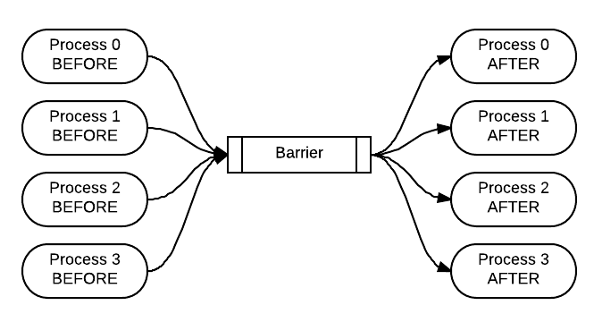
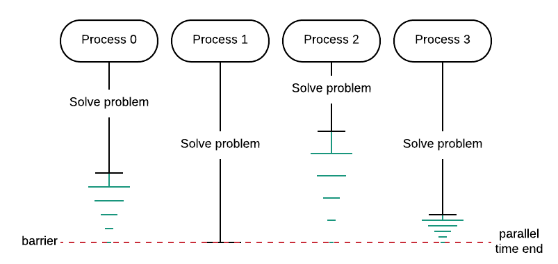
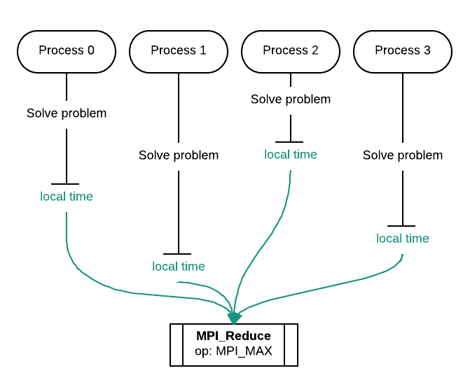

******************************************
Barrier Synchronization, Timing and Tags
******************************************

16. The Barrier Coordination Pattern
*****************************************************

*file: patternlets/MPI/16.barrier/barrier.c*

*Build inside 16.barrier directory:*
::

  make barrier

*Execute on the command line inside 16.barrier directory:*
::

  mpirun -np <number of processes> ./barrier

A barrier is used when you want all the processes to complete a portion of
code before continuing. Use this exercise to verify that it is occurring when
you add the call to the MPI_Barrier function. After adding the barrier call,
the BEFORE strings should all be printed prior to all of the AFTER strings.
You can visualize the execution of the program with the barrier function
like this, with time moving from left to right:

.. literalinclude:: ../patternlets/MPI/16.barrier/barrier.c
    :language: c
    :linenos:

17. Timing code using the Barrier Coordination Pattern
******************************************************

*file: patternlets/MPI/17.barrier+Timing/barrier+timing.c*

*Build inside 17.barrier+Timing directory:*
::

  make barrier+timing

*Execute on the command line inside 17.barrier+Timing directory:*
::

  mpirun -np <number of processes> ./barrier+timing

The primary purpose of this exercise is to illustrate that one of the most
practical uses of a barrier is to ensure that you are getting legitimate timings
for your code examples. By using a barrier, you ensure that all processes have
finished before recording the time using the master process. If a process finishes
before all processes have completed their portion, the process must wait as
indicated in green in the diagram below. Thus, the parallel
execution time is the time it took the longest process to finish.

.. topic:: To do:

  Run the code several times and determine the average, median, and minimum
  execution time when the code has a barrier and when it does not. Without
  the barrier, what process is being timed?

.. literalinclude:: ../patternlets/MPI/17.barrier+Timing/barrier+timing.c
    :language: c
    :linenos:

18. Timing code using the Reduction pattern
******************************************************

*file: patternlets/MPI/18.reduce+Timing/reduce+timing.c*

*Build inside 18.reduce+Timing directory:*
::

  make reduce+timing

*Execute on the command line inside 18.reduce+Timing directory:*
::

  mpirun -np <number of processes> ./reduce+timing

We can also use reduction for obtaining the parallel execution time of a program.
In this example, each process individually records how long it took to finish.
Each of these local times is then reduced to a single time using the max operator.
This allows us to find the largest of the input times to totalTime.

.. literalinclude:: ../patternlets/MPI/18.reduce+Timing/reduce+timing.c
    :language: c
    :linenos:

19. Sequence Numbers
*****************************************************

*file: patternlets/MPI/19.sequenceNumbers/sequenceNumbers.c*

*Build inside 19.sequenceNumbers directory:*
::

  make sequenceNumbers

*Execute on the command line inside 19.sequenceNumbers directory:*
::

  mpirun -np <number of processes> ./sequenceNumbers

Tags can be placed on messages that are sent from a non-master process and received
by the master process. Using tags is an alternative form of simulating the barrier
in example 16 above.

.. topic:: To do:

  What has caused the changes in the program's behavior and why has it changed?
  Can you figure out what the different tags represent and how the tags work in
  relation to the send and receive functions?

.. literalinclude:: ../patternlets/MPI/19.sequenceNumbers/sequenceNumbers.c
    :language: c
    :linenos:
