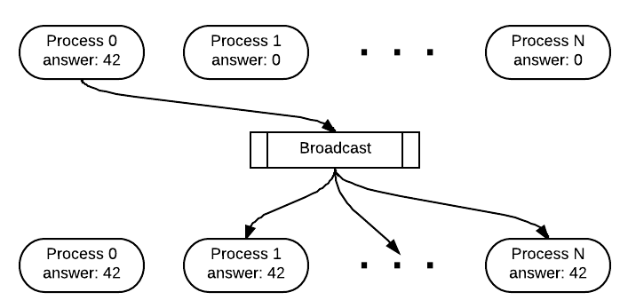

*********************************************************
Broadcast
*********************************************************

There is often a need for all the processes to share data
by ensuring that all of them have a copy of the same data in the memory
of their process. This form of communication is often done with
a *broadcast* from the master to all of the worker processes.

08. Broadcast: a special form of message passing
**************************************************

*file: patternlets/MPI/08.broadcast/broadcast.c*

*Build inside 08.broadcast directory:*
::

  make broadcast

*Execute on the command line inside 08.broadcast directory:*
::

  mpirun -np <number of processes> ./broadcast

This example shows how a data item read from a file can be sent to all the processes.
Lines 29 through 34 demonstrate reading data from a file. After opening the file and
asserting that the file is not empty, the file is read by the *fscanf* function.
This function then stores the data from the file as an integer in the answer
variable. Note that only process 0 has the data from the file stored in answer.

In order to send the data from process 0 to all of the processes in the
communicator, it is necessary to *broadcast*. During a broadcast, one process
sends the same data to all of the processes. A common use of broadcasting is
to send user input to all of the processes in a parallel program. In our example,
the broadcast is sent from process 0 and looks like this:

.. literalinclude:: ../patternlets/MPI/08.broadcast/broadcast.c
    :language: c
    :linenos:

.. note::

  In this single-program, multiple data scenario, *all* processes execute the
  `MPI_Bcast` function. The fourth parameter dictates which process id is
  doing the sending to all of the other processes, who are waiting to receive.

.. topic:: For further exploration

  This program illustrates a common pattern in many parallel and distributed programs:
  the master node (very typically rank 0) is the only one to read in data from a file.
  It is then responsible for distributing the data to all of the other processes.
  MPI also has defined collective operations for file reading and writing that
  can be done in parallel. This is referred to as *parallel IO*. You could
  investigate this topic further. Your system will need to support it to take
  advantage of it.

.. topic:: To do:

  Run this code with several processes (8 -12). What do you observe about the
  order in which the printing occurs among the processes? Is it repeatable or
  does it change each time you run it?

09. Broadcast: incorporating user input
**************************************************

*file: patternlets/MPI/09.broadcastUserInput/broadcastUserInput.c*

*Build inside 09.broadcastUserInput directory:*
::

  make broadcastUserInput

*Execute on the command line inside 09.broadcastUserInput directory:*
::

  mpirun -np <number of processes> ./broadcastUserInput <integer>

We can use command line arguments to incorporate user input into a program.
Command line arguments are taken care of by two functions in main(). The first
of these functions is **argc** which is an integer referring to the number
of arguments passed in on the command line. **argv** is the second function.
It is an array of pointers that points to each argument passed in.
argv[0] always holds the name of the program and in MPI argv[1] holds the
number of processes *when initially run using mpirun*. However, after the
`MPI_Init` function is called as in line 51 below, argc and argv are updated
to contain only the command line arguments to the program itself.

We modified the previous broadcast example to include an additional command line
argument, an integer. Instead of reading a scalar value from a file, this allows
a user to decide what value is broadcast in the program when it is executed. In
this example, after line 51, argc is 2, and argv[1] contains the integer you
entered at the end of the command. The function called `getInput` then acts like
any other C program with command line arguments.

.. topic:: To do:

  Try running the program without an argument for the number of processes.

  **mpirun ./broadcastUserInput <integer>**

  What is the default number of processes used on your system when we do not
  provide a number?

.. literalinclude:: ../patternlets/MPI/09.broadcastUserInput/broadcastUserInput.c
    :language: c
    :linenos:

10. Broadcast: send receive equivalent
**************************************************

file: patternlets/MPI/10.broadcastSendReceive/broadcastSendReceive.c*

*Build inside 10.broadcastSendReceive directory:*
::

  make broadcastSendReceive

*Execute on the command line inside 10.broadcastSendReceive directory:*
::

  mpirun -np <number of processes> ./broadcastSendReceive

This example shows how to ensure that all processes have a copy of an array
created by a single *master* process. Master process 0 sends the array to each
process, all of which receive the array.

.. note::

  This code works to broadcast data to all processes, but this is such a common
  pattern that the MPI library contains the built-in `MPI_Bcast` function.
  Compare this example to the following one to see the value in using the single
  function.

.. literalinclude:: ../patternlets/MPI/10.broadcastSendReceive/broadcastSendReceive.c
  :language: c
  :linenos:

11. Broadcast: send data to all processes
**************************************************

*file: patternlets/MPI/11.broadcast2/broadcast2.c*

*Build inside 11.broadcast2 directory:*
::

  make broadcast2

*Execute on the command line inside 11.broadcast2 directory:*
::

  mpirun -np <number of processes> ./broadcast2

The send and receive pattern where one process sends the same data to all
processes is used frequently. Broadcast was created for this purpose. This example
is the same as the previous example except that we send the modified array
using broadcast.

.. literalinclude:: ../patternlets/MPI/11.broadcast2/broadcast2.c
    :language: c
    :linenos:
