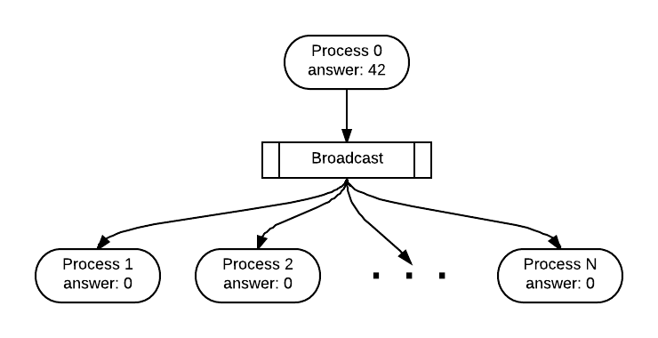

*********************************************************
Data Decomposition and Broadcast Synchronization
*********************************************************

05. Data Decomposition: on *equal-sized chunks* using parallel-for
************************************************************************

*file: patternlets/MPI/05.parallelLoop-equalChunks/parallelLoopEqualChunks.c*

*Build inside 05.parallelLoop-equalChunks directory:*
::

  make parallelLoopEqualChunks

*Execute on the command line inside 05.parallelLoop-equalChunks directory:*
::

  mpirun -np <number of processes> ./parallelLoopEqualChunks

In this example, the data being decomposed is simply the set of integers
from zero to REPS * numProcesses, which are used in the for loop. Thus,
each process receives REPS / numProcesses iterations to perform, thereby
enforcing the *equal-sized chunks* pattern. This type of decomposition is
commonly used when accessing data that is stored in consecutive memory locations
(such as an array). Verify that the default behavior for the scatter function is:

.. image:: EqualChunks.png
	:width: 800

.. literalinclude:: ../patternlets/MPI/05.parallelLoop-equalChunks/parallelLoopEqualChunks.c
    :language: c
    :linenos:

06. Data Decomposition: on *chunks of size 1* using parallel-for
**************************************************************************

*file: patternlets/MPI/06.parallelLoop-chunksOf1/parallelLoopChunksOf1.c*

*Build inside 06.parallelLoop-chunksOf1 directory:*
::

  make parallelLoopChunksOf1

*Execute on the command line inside 06.parallelLoop-chunksOf1 directory:*
::

  mpirun -np <number of processes> ./parallelLoopChunksOf1

A simple decomposition sometimes used when your loop is not accessing consecutive
memory locations would be to let each process do one iteration, up to N processes,
then start again with process 0 taking the next iteration. A for loop on line 29
is used to implement this type of data decomposition.

.. image:: ChunksOf1.png
	:width: 800

This is a basic example that does not yet include a data array, though
it would typically be used when each process would be working on a portion
of an array that could have been looped over in a sequential solution.

.. literalinclude:: ../patternlets/MPI/06.parallelLoop-chunksOf1/parallelLoopChunksOf1.c
    :language: c
    :linenos:

07. Broadcast: a special form of message passing
**************************************************

*file: patternlets/MPI/07.broadcast/broadcast.c*

*Build inside 07.broadcast directory:*
::

  make broadcast

*Execute on the command line inside 07.broadcast directory:*
::

  mpirun -np <number of processes> ./broadcast

This example shows how a data item read from a file can be sent to all the processes.
Lines 29 through 34 demonstrate reading data from a file. After opening the file and
asserting that the file is not empty, the file is read by the *fscanf* function.
This function then stores the data from the file as an integer in the answer
variable. Note that only process 0 has the data from the file stored in answer.

In order to send the data from process 0 to all of the processes in the
communicator, it is necessary to *broadcast*. During a broadcast, one process
sends the same data to all of the processes. A common use of broadcasting is
to send user input to all of the processes in a parallel program. In our example,
the broadcast is sent from process 0 and looks like this:

.. literalinclude:: ../patternlets/MPI/07.broadcast/broadcast.c
    :language: c
    :linenos:

08. Broadcast: send data to all processes
**************************************************

*file: patternlets/MPI/08.broadcast2/broadcast2.c*

*Build inside 08.broadcast2 directory:*
::

  make broadcast2

*Execute on the command line inside 08.broadcast2 directory:*
::

  mpirun -np <number of processes> ./broadcast2

This example shows how to ensure that all processes have a copy of an array
created by a single *master* node.

.. literalinclude:: ../patternlets/MPI/08.broadcast2/broadcast2.c
    :language: c
    :linenos:
