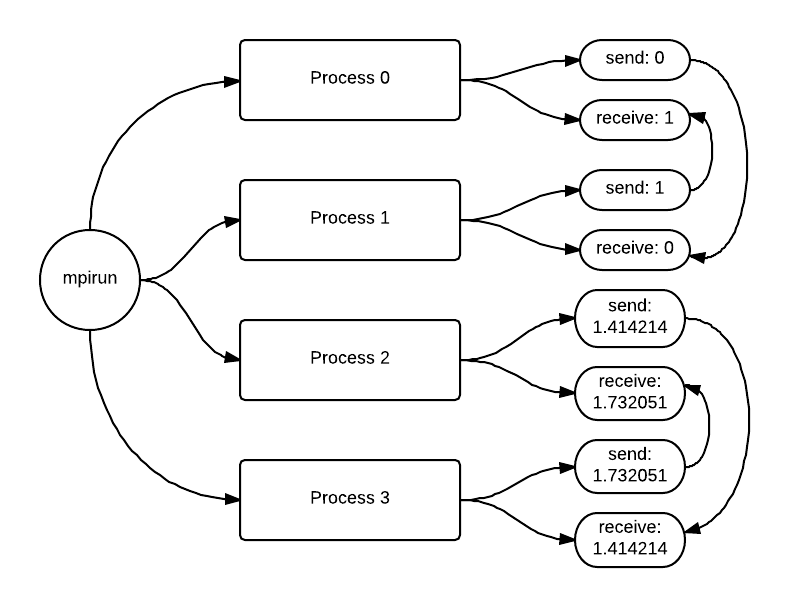

*********************************************************
Master Worker Pattern and Message Passing
*********************************************************

00. Single Program, Multiple Data
*********************************

*file: patternlets/MPI/00.spmd/spmd.c*

*Build inside 00.spmd directory:*
::

  make spmd

*Execute on the command line inside 00.spmd directory:*
::

  mpirun -np <number of processes> ./spmd

First let us illustrate the basic components of an MPI program,
which by its nature uses a single program that runs on each process.
Note what gets printed is different for each process, thus the
processes using this one single program can have different data values
for its variables.  This is why we call it single program, multiple data.

On the command line, *mpirun* tells the system to start <number of processes>
instances of the program. The call to *MPI_INIT* on line 25 tells the MPI
system to setup. This includes allocating storage for message buffers and
deciding the rank each process receives. *MPI_INIT* also defines a communicator
called *MPI_COMM_WORLD*. A communicator is a group of processes that can
communicate with each other by sending messages. The *MPI_Finalize* command
tells the MPI system that we are finished and it deallocates MPI resources.

.. topic:: To do:

  Can you determine what the purpose of the *MPI_Comm_rank* function and
  *MPI_Comm_size* function? How is the communicator related to these functions?

.. literalinclude:: ../patternlets/MPI/00.spmd/spmd.c
    :language: c
    :linenos:

01. The Master-Worker Implementation Strategy Pattern
*****************************************************

*file: patternlets/MPI/01.masterWorker/masterWorker.c*

*Build inside 01.masterWorker directory:*
::

  make masterWorker

*Execute on the command line inside 01.masterWorker directory:*
::

  mpirun -np <number of processes> ./masterWorker

The master worker pattern is illustrated in this simple example.  The pattern
consists of one process, called the master, executing one block of code while
the rest of the processes, called workers, are executing a different block of code.

.. literalinclude:: ../patternlets/MPI/01.masterWorker/masterWorker.c
    :language: c
    :linenos:

02. Message passing deadlock, using Send-Receive of a single value
*******************************************************************

*file: patternlets/MPI/02.messagePassingDeadlock/messagePassingDeadlock.c*

*Build inside 02.messagePassingDeadlock directory:*
::

  make messagePassingDeadlock

*Execute on the command line inside 02.messagePassingDeadlock directory:*
::

  mpirun -np <number of processes> ./messagePassingDeadlock

This example shows the pattern of sending and receiving messages between
various processes. The following code displays 2-way communication between
pairs with message passing occurring between pairs of odd and even rank processes.

(rank 0, rank 1), (rank 2, rank 3), (rank 4, rank 5), ... ,

The message that is being passed is the rank of the current process.
Conceptually, the running code is executing like this, where time is moving
from top to bottom:

.. image:: Deadlock.png
	:width: 500

.. topic:: To do:

  Can you explain why this program deadlocks and how we might avoid this
  situation?

.. literalinclude:: ../patternlets/MPI/02.messagePassingDeadlock/messagePassingDeadlock.c
    :language: c
    :linenos:

03. Message passing 1, using Send-Receive of a single value
*******************************************************************
*file: patternlets/MPI/03.messagePassing/messagePassing.c*

*Build inside 03.messagePassing directory:*
::

  make messagePassing

*Execute on the command line inside 03.messagePassing directory:*
::

  mpirun -np <number of processes> ./messagePassing

This is an extension of the previous example that highlights how a deadlock
might occur from message passing. We will show one possible solution for
fixing this problem. We can avoid a deadlock by simply reversing
the order of one of the receive/send pairs.  Now, we have one receive/send
pair and one send/receive pair. As shown in the diagram below where time
is moving from top to bottom, even processes are receive/send pairs and
odd processes are send/receive pairs.

.. topic:: To do:

  Compile and run using 4, 6, 8 and 10 processes. Note that the program
  now completes without deadlocking. Why does reversing one of the receive/send
  pairs allow us to avoid the deadlock situation all together?

  Run using 5 processes. What process threw an error and why was an error thrown?
  *Hint:* See diagram below.

.. image:: MessagePassingOdd.png
  :width: 700

.. literalinclude:: ../patternlets/MPI/03.messagePassing/messagePassing.c
  :language: c
  :linenos:

04. Message passing 2,  using Send-Receive of an array of values
****************************************************************

*file: patternlets/MPI/04.messagePassing2/messagePassing2.c*

*Build inside 04.messagePassing2 directory:*
::

  make messagePassing2

*Execute on the command line inside 04.messagePassing2 directory:*
::

  mpirun -np <number of processes> ./messagePassing2

The messages sent and received by processes can be of types other than
ints. Here the message that is being passed is a string (array of chars).
The *sprintf* function is similar to *printf* except that it writes to a string
instead of stdout. This example follows the previous message passing examples
in that it passes strings between pairs of odd and even rank processes.

.. literalinclude:: ../patternlets/MPI/04.messagePassing2/messagePassing2.c
    :language: c
    :linenos:

05. Message passing 3, using Send-Receive with master-worker pattern
*********************************************************************

*file: patternlets/MPI/05.messagePassing3/messagePassing3.c*

*Build inside 05.messagePassing3 directory:*
::

  make messagePassing3

*Execute on the command line inside 05.messagePassing3 directory:*
::

  mpirun -np <number of processes> ./messagePassing3

Sending and receiving typically occurs in pairs. We will investigate a scenario
is which this is *not* the case. Suppose we have four processes, 0 through 3,
all of which are arranged in a "ring". We want each process to communicate a
modified string containing sequential ranks to the next process. Process 0 begins
by sending its rank to process 1. Process 1 receives a string containing
a 0. Next, process 1 adds its rank to the string and sends the string to process
2. Then, process 2 receives the string containing 0 and 1, and so on. This
continues until process 0 receives the final string from the last process (process with the largest rank). Thus, process 0 is the beginning and ending
location of the "ring". This type of circular dependency can be thought of like this:

.. image:: CircularDependancy.png
  :width: 800

.. topic:: To do:

  In our example, when will this communication pattern fail to execute properly
  and finish? What is needed to be able to guarantee completion?

.. literalinclude:: ../patternlets/MPI/05.messagePassing3/messagePassing3.c
    :language: c
    :linenos:
