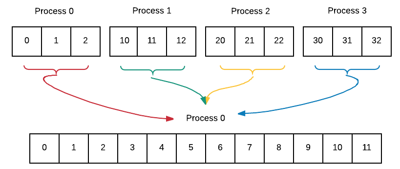

*********************************************************
Reduction, Scatter and Gather
*********************************************************

09. Collective Communication: Reduction
***************************************

*file: patternlets/MPI/09.reduction/reduction.c*

*Build inside 09.reduction directory:*
::

  make reduction

*Execute on the command line inside 09.reduction directory:*
::

  mpirun -np <number of processes> ./reduction

Once processes have performed independent concurrent computations, possibly
on some portion of decomposed data, it is quite common to then *reduce*
those individual computations into one value.  This example shows a simple
calculation done by each process being reduced to a sum and a maximum.
In this example, MPI, has built-in computations, indicated by MPI_SUM and
MPI_MAX in the following code. With four processes, the code is as such:

.. image:: Reduction.png
	:width: 800

.. literalinclude:: ../patternlets/MPI/09.reduction/reduction.c
    :language: c
    :linenos:

10. Collective Communication: Reduction
****************************************

*file: patternlets/MPI/10.reduction2/reduction2.c*

*Build inside 10.reduction2 directory:*
::

  make reduction2

*Execute on the command line inside 10.reduction2 directory:*
::

  mpirun -np <number of processes> ./reduction2

Here is a second reduction example using arrays of data. Each process computes
its individual *srcArray*. A reduction is used to sum all of these individual
arrays and the result is stored in *destArray*.

.. literalinclude:: ../patternlets/MPI/10.reduction2/reduction2.c
    :language: c
    :linenos:

11. Collective communication: Scatter for message-passing data decomposition
****************************************************************************

*file: patternlets/MPI/11.scatter/scatter.c*

*Build inside 11.scatter directory:*
::

  make scatter

*Execute on the command line inside 11.scatter directory:*
::

  mpirun -np <number of processes> ./scatter

If processes can independently work on portions of a larger data array
using the geometric data decomposition pattern, the scatter pattern can be
used to ensure that each process receives a copy of its portion of the array.
Process 0 gets the first chunk, process 2 gets the second chunk ... until
the entire array has been distributed. This is essentially the equal chunks
pattern. It is so common that there MPI defined the scatter function for this
purpose.

.. literalinclude:: ../patternlets/MPI/11.scatter/scatter.c
    :language: c
    :linenos:

12. Collective communication: Gather for message-passing data decomposition
***************************************************************************

*file: patternlets/MPI/12.gather/gather.c*

*Build inside 12.gather directory:*
::

  make gather

*Execute on the command line inside 12.gather directory:*
::

  mpirun -np <number of processes> ./gather

If processes can independently work on portions of a larger data array
using the geometric data decomposition pattern,
the gather pattern can be used to ensure that each process sends
a copy of its portion of the array back to the root, or master process.
Thus, gather is the reverse of scatter. Here is the idea:

.. literalinclude:: ../patternlets/MPI/12.gather/gather.c
    :language: c
    :linenos:
