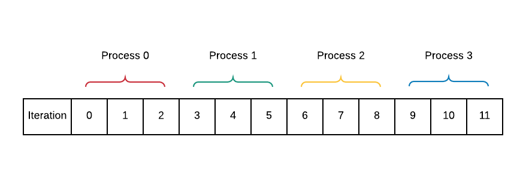

*********************************************************
Data Decomposition: Reduction, Scatter and Gather
*********************************************************

09. Collective Communication: Reduction
***************************************

*file: patternlets/MPI/09.reduction/reduction.c*

*Build inside 09.reduction directory:*
::

  make reduction

*Execute on the command line inside 09.reduction directory:*
::

  mpirun -np <number of processes> ./reduction

Once processes have performed independent concurrent computations, possibly
on some portion of decomposed data, it is quite common to then *reduce*
those individual computations into one value.  This example shows a simple
calculation done by each process being reduced to a sum and a maximum.
In this example, MPI, has built-in computations, indicated by MPI_SUM and
MPI_MAX in the following code. With four processes, the code is implemented
like this:

.. image:: Reduction.png
	:width: 800

.. literalinclude:: ../patternlets/MPI/09.reduction/reduction.c
    :language: c
    :linenos:

10. Collective Communication: Reduction
****************************************

*file: patternlets/MPI/10.reduction2/reduction2.c*

*Build inside 10.reduction2 directory:*
::

  make reduction2

*Execute on the command line inside 10.reduction2 directory:*
::

  mpirun -np <number of processes> ./reduction2

Here is a second reduction example using arrays of data. Each process computes
its individual *srcArray*. A reduction is used to sum all of these individual
arrays and the result is stored in *destArray*.

.. literalinclude:: ../patternlets/MPI/10.reduction2/reduction2.c
    :language: c
    :linenos:

11. Data Decomposition: on *equal-sized chunks* using parallel-for
************************************************************************

*file: patternlets/MPI/11.parallelLoop-equalChunks/parallelLoopEqualChunks.c*

*Build inside 11.parallelLoop-equalChunks directory:*
::

  make parallelLoopEqualChunks

*Execute on the command line inside 11.parallelLoop-equalChunks directory:*
::

  mpirun -np <number of processes> ./parallelLoopEqualChunks

In this example, the data being decomposed is simply the set of integers
from zero to REPS * numProcesses, which are used in the for loop. Thus,
each process receives REPS / numProcesses iterations to perform, thereby
enforcing the *equal-sized chunks* pattern. This type of decomposition is
commonly used when accessing data that is stored in consecutive memory locations
(such as an array). Verify that the program behavior is:

.. literalinclude:: ../patternlets/MPI/11.parallelLoop-equalChunks/parallelLoopEqualChunks.c
    :language: c
    :linenos:

12. Data Decomposition: on *chunks of size 1* using parallel-for
**************************************************************************

*file: patternlets/MPI/12.parallelLoop-chunksOf1/parallelLoopChunksOf1.c*

*Build inside 12.parallelLoop-chunksOf1 directory:*
::

  make parallelLoopChunksOf1

*Execute on the command line inside 12.parallelLoop-chunksOf1 directory:*
::

  mpirun -np <number of processes> ./parallelLoopChunksOf1

A simple decomposition sometimes used when your loop is not accessing consecutive
memory locations would be to let each process do one iteration, up to N processes,
then start again with process 0 taking the next iteration. A for loop on line 29
is used to implement this type of data decomposition.

.. image:: ChunksOf1.png
  :width: 800

This is a basic example that does not yet include a data array, though
it would typically be used when each process would be working on a portion
of an array that could have been looped over in a sequential solution.

.. literalinclude:: ../patternlets/MPI/12.parallelLoop-chunksOf1/parallelLoopChunksOf1.c
    :language: c
    :linenos:

13. Collective communication: Scatter for message-passing data decomposition
****************************************************************************

*file: patternlets/MPI/13.scatter/scatter.c*

*Build inside 13.scatter directory:*
::

  make scatter

*Execute on the command line inside 13.scatter directory:*
::

  mpirun -np <number of processes> ./scatter

If processes can independently work on portions of a larger data array
using the geometric data decomposition pattern, the scatter pattern can be
used to ensure that each process receives a copy of its portion of the array.
Process 0 gets the first chunk, process 2 gets the second chunk ... until
the entire array has been distributed. This is essentially the equal chunks
pattern. It is so common that MPI defined the scatter function for this
purpose.

.. literalinclude:: ../patternlets/MPI/13.scatter/scatter.c
    :language: c
    :linenos:

14. Collective communication: Gather for message-passing data decomposition
***************************************************************************

*file: patternlets/MPI/14.gather/gather.c*

*Build inside 14.gather directory:*
::

  make gather

*Execute on the command line inside 14.gather directory:*
::

  mpirun -np <number of processes> ./gather

If processes can independently work on portions of a larger data array
using the geometric data decomposition pattern,
the gather pattern can be used to ensure that each process sends
a copy of its portion of the array back to the root, or master process.
Thus, gather is the reverse of scatter. Here is the idea:

.. image:: Gather.png
	:width: 750

.. literalinclude:: ../patternlets/MPI/14.gather/gather.c
    :language: c
    :linenos:
