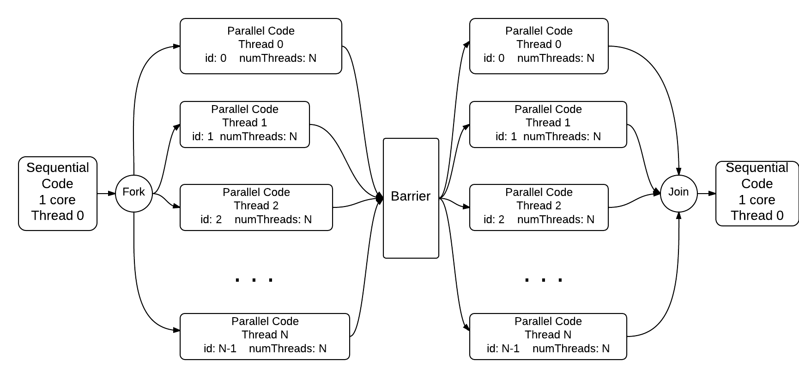

*********************************************************
Shared Memory Program Structure and Coordination Patterns
*********************************************************

0. Program Structure Implementation Strategy: The basic fork-join pattern
*************************************************************************

*file: openMP/00.forkJoin/forkJoin.c*

*Build inside 00.forkJoin directory:*
::

	make forkjoin

*Execute on the command line inside 00.forkJoin directory:*
::

	./forkjoin

The *omp parallel* pragma on line 21, when uncommented, tells the compiler to
fork a set of threads to execute the next line of code (later you will see how this is done for a block of code).  You can conceptualize how this works using the following diagram, where time is moving from left to right:

.. image:: ForkJoin.png
	:width: 800

Observe what happens on the machine
where you are running this code, both when you have the pragma commented (no fork) and when you uncomment it (adding a fork).

Note that in OpenMP the join is implicit and does not require a pragma directive.

.. literalinclude::
	../patternlets/openMP/00.forkJoin/forkJoin.c
	:language: c
	:linenos:

1. Program Structure Implementation Strategy: Fork-join with setting the number of threads
******************************************************************************************

*file openMP/01.forkJoin2/forkJoin2.c*

*Build inside 01.forkJoin2 directory:*
::

	make forkjoin2

*Execute on the command line inside 01.forkJoin2 directory:*
::

	./forkjoin2

This code illustrates that one program can fork and join more than once
and that programmers can set the number of threads to use in the parallel forked code.

Note on line 28 there is an OpenMP function called *omp_set_num_threads*
for setting the number of threads to use for each
*fork*, which occur when the omp_parallel pragma is used.
Also note on line 35 that you can set the number of threads for the very next
fork indicated by an omp_parallel pragma by augmenting the pragma as shown in line 35.
Follow the instructions in the header of the code file to understand the difference
between these.

.. literalinclude::
	../patternlets/openMP/01.forkJoin2/forkJoin2.c
	:language: c
	:linenos:

2. Program Structure Implementation Strategy: Single Program, multiple data
***************************************************************************

*file: openMP/02.spmd/spmd.c*

*Build inside 02.spmd directory:*
::

	make spmd

*Execute on the command line inside 02.spmd directory:*
::

	./spmd

Note how there are OpenMP functions to
obtain a thread number and the total number of threads.
We have one program, but multiple threads executing in the forked section,
each with a copy of the id and num_threads variables.
Programmers write one program, but write it in such a way that
each thread has its own data values for particular variables.
This is why this is called the *single program, multiple data* (SPMD) pattern.

Most parallel programs use this SPMD pattern, because writing one program
is ultimately the most efficient method for programmers.  It does require you
as a programmer to understand how this works, however.  Think carefully about
how each thread executing in parallel has its own set of variables.  Conceptually,
it looks like this, where each thread has its own memory for the variables id and numThreads:

.. image:: ForkJoin_SPMD.png
	:width: 800

When the pragma is uncommented in the code below, note what the default number of threads
is.  Here the threads are forked and execute the block of code inside the
curly braces on lines 22 through 26.  This is how we can have a block of code executed
concurrently on each thread.

When you execute the parallel version containing the pragma (uncommenting line 20),
what do you observe about the order of the printed lines?  Run the program multiple times--
does the ordering change?  This illustrates an important point about threaded programs:
*the ordering of execution of statements between threads is not guaranteed.*  This is also
illustrated in the diagram above.

.. literalinclude::
	../patternlets/openMP/02.spmd/spmd.c
    :language: c
    :linenos:

3. Program Structure Implementation Strategy: Single Program, multiple data with user-defined number of threads
***************************************************************************************************************

*file: openMP/03.spmd2/spmd2.c*

*Build inside 03.spmd2 directory:*
::

	make spmd2

*Execute on the command line inside 03.spmd2 directory:*
::

	./spmd2 4
	Replace 4 with other values for the number of threads

Here we enter the number of threads to use on the command line.  This is a useful way to
make your code versatile so that you can use as many threads as you would like.

.. literalinclude::
	../patternlets/openMP/03.spmd2/spmd2.c
    :language: c
    :linenos:

4. Coordination: Synchronization with a Barrier
***********************************************

*file: openMP/04.barrier/barrier.c*

*Build inside 04.barrier directory:*
::

	make barrier

*Execute on the command line inside 04.barrier directory:*
::

	./barrier 4
	Replace 4 with other values for the number of threads

The barrier pattern is used in parallel programs to ensure that all threads complete
a parallel section of code before execution continues. This can be necessary when
threads are generating computed data (in an array, for example) that needs to be
completed for use in another computation.

Conceptually, the running code is excuting like this:

Note what happens with and without the commented pragma on line 31.

.. literalinclude::
	../patternlets/openMP/04.barrier/barrier.c
    :language: c
    :linenos:

5. Program Structure: The Master-Worker Implementation Strategy
***************************************************************

*file: openMP/05.masterWorker/masterWorker.c*

*Build inside 05.masterWorker directory:*
::

	make masterWorker

*Execute on the command line inside 05.masterWorker directory:*
::

	./masterWorker 4
	Replace 4 with other values for the number of threads

Once you have mastered the notion of fork-join and single-program, multiple data,
the next common pattern that programmers use in association with these patterns
is to have one thread, called the master, execute one block of code when it forks while the rest
of the threads, called workers, execute a different block of code when they fork.
This is illustrated in this simple example (useful code would be more complicated).

.. literalinclude::
	../patternlets/openMP/05.masterWorker/masterWorker.c
    :language: c
    :linenos:
