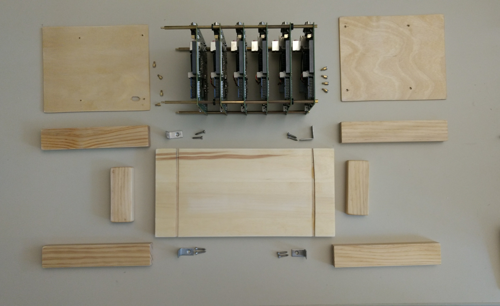
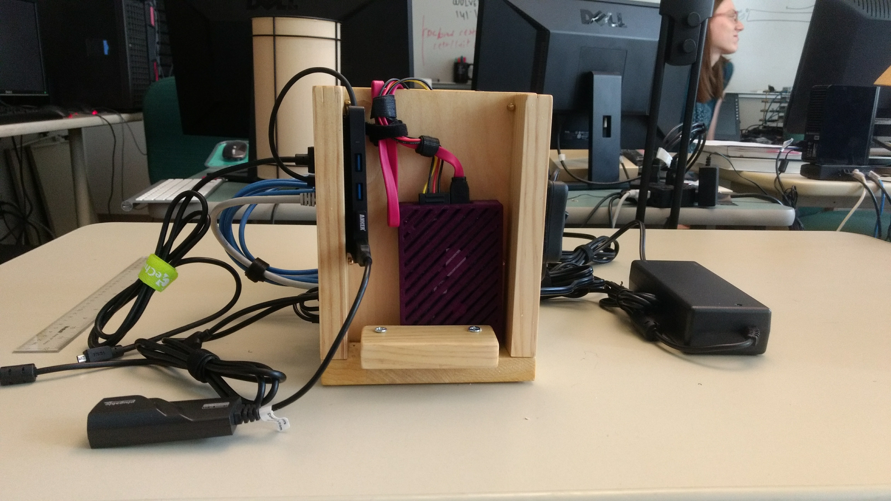

.. Building a Tegra TK1 documentation master file, created by
   Rohit Bagda on August 15 2017.
   You can adapt this file completely to your liking, but it should at least
   contain the root `toctree` directive.

***************************************
Building a Nvidia Jetson TK1 Cluster
***************************************
**Last Updated:** |date|

This module acts as a tutorial to help users build a cluster of Nvidia Jetson TK1 cluster for Parallel Programming and Distributed Processing. The guide is a step by step procedure to build a 6 Node TK1 cluster with a shared network file system. Note that clusters can be of any length n≥2. Basic knowledge of Linux Terminal will be helpful.

Materials Needed
#################
1.  6 x `Tegra TK1`_
2. 20 x `M3 brass standoff, 31mm long`_
3.  4 x `M3 brass standoff, 50mm long`_
4.  1 x `HDD`_ (Preferably 128 GB) with `SATA Data`_ (1 ft.), `Power Cable`_ (1 ft.).
5.  6 x `Ethernet Cable`_ (Preferably 1 ft. long)
6.  1 x `12V 12.5A Battery Power Supply`_
7.  1 x `5 Port USB Battery Charger`_
8.  1 x `8 Port Ethernet Switch`_
9.  1 x `Monitor`_, `Keyboard and Mouse`_
10.  1 x `USB Hub`_
11.  1 x `Ethernet to USB Adapter`_
12. 2 x `Barrel On-Off Switch`_
13. 1 x `1 Female to 6 Male 2.1 mm Barrel Splitter`_
14. 1 x `1 Female to 6 Male 2.1 mm Barrel Splitter`_

.. _Tegra TK1: https://www.amazon.com/NVIDIA-Jetson-TK1-Development-Kit/dp/B00L7AWOEC/ref=sr_1_1?ie=UTF8&qid=1502920391&sr=8-1&keywords=nvidia+tegra+k1

.. _M3 brass standoff, 31mm long: https://www.amazon.com/gp/product/B00AO4370M/ref=oh_aui_detailpage_o04_s00?ie=UTF8&psc=1

.. _M3 brass standoff, 50mm long: https://www.amazon.com/gp/product/B00AO4332O/ref=oh_aui_detailpage_o00_s00?ie=UTF8&psc=1

.. _HDD: https://www.amazon.com/Seagate-BarraCuda-3-5-Inch-Internal-ST1000DM010/dp/B01LNJBA2I/ref=sr_1_3?s=electronics&ie=UTF8&qid=1502928646&sr=1-3&keywords=1Tb+hdd

.. _Power Cable: https://www.amazon.com/Nippon-Labs-SATA-15PF2-4PM-1FT-12-Inch-Female/dp/B00N7OJ1H4/ref=sr_1_28?s=electronics&ie=UTF8&qid=1502925628&sr=1-28&keywords=sata+cable+12+inch

.. _SATA Data: https://www.amazon.com/RELPER-Long-Cable-Double-Locking/dp/B00V037086/ref=sr_1_28?s=electronics&ie=UTF8&qid=1502925892&sr=1-28&keywords=1+pc+sata+data+cable

.. _Ethernet Cable: https://www.amazon.com/Cable-Matters-5-Pack-Snagless-Ethernet/dp/B00C4U030G/ref=sr_1_1?s=electronics&ie=UTF8&qid=1499808595&sr=1-1&keywords=Ethernet+cable+1ft

.. _12V 12.5A Battery Power Supply: https://www.amazon.com/gp/product/B01N3ASWZ0/ref=ox_sc_act_title_2?smid=A325274ZEF9XYZ&psc=1

.. _5 Port USB Battery Charger: https://www.amazon.com/Anker-Charger-PowerPort-Multi-Port-Samsung/dp/B00VH8ZW02/ref=sr_1_1?s=electronics&ie=UTF8&qid=1502920716&sr=1-1-spons&keywords=anker+5+port+usb+charger&psc=1

.. _8 Port Ethernet Switch: https://www.amazon.com/TRENDnet-Unmanaged-GREENnet-Switching-TEG-S80G/dp/B001QUA6RA/ref=sr_1_2?s=electronics&ie=UTF8&qid=1502920782&sr=1-2-spons&keywords=greennet+8+port+switch&psc=1

.. _Monitor: https://www.amazon.com/GeChic-2501C-Portable-Monitor-Inputs/dp/B00H4MWMWQ/ref=sr_1_1?s=electronics&ie=UTF8&qid=1499809271&sr=1-1-spons&keywords=portable+monitor&psc=1

.. _Keyboard and Mouse: https://www.amazon.com/Keyboard-Jelly-Comb-Rechargeable-Wireless/dp/B01NCW2JR9/ref=sr_1_4?s=electronics&ie=UTF8&qid=1499809455&sr=1-4&keywords=jelly+comb+keyboard+mouse+combo

.. _USB Hub: https://www.amazon.com/Anker-4-Port-Macbook-Surface-Notebook/dp/B00XMD7KPU/ref=sr_1_1?s=electronics&ie=UTF8&qid=1502925193&sr=1-1&keywords=anker+usb+hub

.. _Ethernet to USB Adapter: https://www.amazon.com/AmazonBasics-1000-Gigabit-Ethernet-Adapter/dp/B00M77HMU0/ref=sr_1_3?s=electronics&ie=UTF8&qid=1502925248&sr=1-3&keywords=Ethernet+to+usb+adapter

.. _Barrel On-Off Switch: https://www.amazon.com/Adafruit-line-switch-barrel-ADA1125/dp/B00KLDPX8U/ref=sr_1_1?s=electronics&ie=UTF8&qid=1502925374&sr=1-1&keywords=barrel+switch

.. _1 Female to 6 Male 2.1 mm Barrel Splitter: https://www.amazon.com/Pro-Power-DC-5-5x2-1mm-Splitter/dp/B072N1513Q/ref=sr_1_7?s=electronics&ie=UTF8&qid=1498423822&sr=1-7&keywords=DC+JACK+6-way+splitter

.. _1 Female to 2 Male 2.1 mm Barrel Splitter: https://www.amazon.com/PHC-DC-3Y-Barrel-Splitter-Female/dp/B009AZZ4ES/ref=sr_1_4?s=electronics&ie=UTF8&qid=1502928515&sr=1-4&keywords=2+to+1+barrel+dc+jack

Overview
##########
Before you begin please read :ref:`Ideas-and-notes` so that you can configure this cluster as you want it to be.

* :ref:`physical-cluster-set-up`
* :ref:`Ubuntu-OS-Setup`
* :ref:`Software`
* :ref:`Cluster-Network`
* :ref:`SSH`
* :ref:`NFS`
* :ref:`bcast.sh-and-shutdown`
* :ref:`time-sync`
* :ref:`Ideas-and-notes`
* :ref:`References`

.. _physical-cluster-set-up:

Setting up the Physical Cluster
###############################

.. image:: images/2.jpg
    :width: 800

.. image:: images/3.jpg
      :width: 800

.. image:: images/5.jpg
      :width: 800

.. image:: images/6.jpg
      :width: 800

We built a wooden structure to put together the 6-node cluster and made it as
compact as possible as shown in the pictures above. You do not strictly need
the wooden frame; we originally built this without it, just using the
standoffs. If you build a frame of some sort like ours, you will also need
small M3 standoffs and possibly the other pieces you see in the pictures above.

Even though each node comes with its own power supply, we chose to
have all six cluster nodes powered through a single power supply. In order to
do this we connected the 5 worker nodes to the 6 to 1 Barrel Splitter (We
couldn't find a 5 to 1). The Female end of 5 to 1 splitter is then connected to
the male end of a Barrel On/Off Switch. The head node is directly connected to
another Barrel Switch. The two switches are then connected to a 2 to 1 Barrel
Splitter and this is then connected to the Power Supply. This eliminates the
need for having 6 different power supplies for the 6 Tegra Boards. We use a 8
Port Ethernet Switch to connect all the nodes of the cluster in a network using
Ethernet cables. The 5 Port USB charger is used to power the Ethernet Switch
and the Monitor. The USB Hub and HDD are connected to the Head Node. Since
these boards do not have Wifi on them we also used a Ethernet to USB Adapter on
the head node for it to connect to the Internet through an external Ethernet
connection.

.. _Ubuntu-OS-Setup:

Setting up Ubuntu OS
#########################
The Jetson TK1 boards do not support Ubuntu 16.04 and hence we will be flashing Ubuntu 14.04 on them.

To set up the OS we will need a Ubuntu 14.04 host machine. On the Host Machine we will be downloading `JetPack Installer`_. In this link download the file which says "JetPack" only. You will need to create a free account on Nvidia's website to do so. Follow this `installation guide`_ to install the JetPack on the host machine and flash each TK1 board. You may select what Nvidia Software you want to install on the Boards but it is recommended to do a full install. This is a time consuming process and may take upto 45 minutes to Flash each TK1 Board.

Each node will have a user 'ubuntu' and a password ‘ubuntu’. Have a look at :ref:`Ideas-and-notes` for user account management and password.

.. _JetPack Installer: https://developer.nvidia.com/embedded/downloads

.. _installation guide: http://docs.nvidia.com/jetpack-l4t/3.1/index.html#developertools/mobile/jetpack/l4t/3.1/jetpack_l4t_install.htm

.. _Software:

Software Installation
#########################################
To begin we will connect the Ethernet switch to the wall in order for all the nodes to have access to the Internet in order to run updates, upgrades and install software.

On a regular terminal we will run the following commands to upgrade Ubuntu 14.04.1 to 14.04.5.
::

  sudo apt-get update
  sudo apt-get upgrade

Then we will install nano (a terminal text editor), SSH (Secure Shell) which will be required for remote login and NTP (Network Time Protocol) which we will need to synchronize date and time across the cluster::

  sudo apt-get install nano
  sudo apt-get install openssh-server
  sudo apt-get install ntp

Next, on the head node we will need install NFS kernel server.::

  sudo apt-get install nfs-kernel-server

And on the worker nodes we will be installing NFS Common::

  sudo apt-get install nfs-common

With this we have installed all the required software for us to run MPI Code on the cluster. If you wish to install any other software then you should install it now because we will be removing internet from the worker nodes and setting up an external Ethernet connection directly to the wall only on the head node.

.. _Cluster-Network:

Creating a Cluster Network
############################
In order for us to establish a network between the cluster through Ethernet cables we will need to assign static ip addresses to each of the nodes. To do this, we need to edit the interfaces file on each node. This can be done by doing the following:

::

  cd /etc/network
  sudo nano interfaces

The interfaces file on each node should look like the following:

.. literalinclude:: ../source/interfaces

Note: the ip address will change according to the order of the 6 nodes, i.e. the 2nd node will have the address 192.168.1.11, the 3rd will have 192.168.1.12 and so on, as its address.

We will need to reboot the entire cluster for this change to take place.

.. _SSH:

SSH Remote Login Setup
#######################

Secure Shell Remote Login is service that provides a secure channel to establish a client-server relationship, and helps a client access a server remotely.
Before we begin we want to assign names to each of the nodes. To do this we changed the hostname and hosts file.

::

  sudo nano /etc/hostname

The hostname file will contain the name of the local host i.e. the name of that node. We gave each node a number by calling them 'tegra1', 'tegra2', ..., 'tegra6'. tegra1 will be our head node in the cluster and tegra2 through tegra6 will be our worker nodes

Next,
In the hosts file we will add the static IP addresses of all the nodes in the hosts file in each of the nodes.
::

  sudo nano /etc/hosts

.. literalinclude:: ../source/hosts

All of the above processes has to be repeated on all 6 nodes.

Since we want the cluster nodes to communicate with each other without having to ask for permission each time we will set up SSH (Secure Shell) remote login. In order to do this, we will generate 2048 bit RSA key-pair on the head node and then copy the SSH ID.
::

  ssh-keygen -t rsa -b 2048

Note: The ssh key should be stored in the .ssh folder and need not require a pass phrase. While generating the keys the user will be prompted for destination folder and a pass phrase. The user can just hit return thrice.

Now, we will copy the SSH ID to all the nodes including the head node.

::

  ssh-copy-id tegra1
  ssh-copy-id tegra2
  ssh-copy-id tegra3
  ssh-copy-id tegra4
  ssh-copy-id tegra5
  ssh-copy-id tegra6

Next, we will need to build the known_hosts file in the .ssh directory. The known_hosts holds id of all the nodes in the cluster and allows password-less access to and from all the nodes in the cluster. To do this we will need to create file with the name of all nodes in the .ssh folder and then use ssh keyscan to generate the known_hosts file.

::

  cd .ssh
  sudo nano name_of_hosts

.. literalinclude:: ../source/name_of_hosts

We will save this file and then change its permissions in order for ssh-keyscan to be able to read the file.

::

  cd
  sudo chmod 666 ~/.ssh/name_of_hosts

The following command will then generate the known_hosts file:

::

  ssh-keyscan -t rsa -f ~/.ssh/name_of_hosts >~/.ssh/known_hosts

Our last step for this setup will be to copy known_hosts, id_rsa public and private keys from the .ssh folder in the head node to the .ssh folder of all the other nodes. We can do this using secure copy.

We use the following steps on the head node to do this:
::

  cd .ssh

Run the following commands: ::

    scp known_hosts id_rsa id_rsa.pub ubuntu@tegra1:.ssh
    scp known_hosts id_rsa id_rsa.pub ubuntu@tegra2:.ssh
    scp known_hosts id_rsa id_rsa.pub ubuntu@tegra3:.ssh
    scp known_hosts id_rsa id_rsa.pub ubuntu@tegra4:.ssh
    scp known_hosts id_rsa id_rsa.pub ubuntu@tegra5:.ssh
    scp known_hosts id_rsa id_rsa.pub ubuntu@tegra6:.ssh

After this we will be able SSH to and from any node in the cluster without a password. This is needed for running MPI programs.

.. _NFS:

Mount Network File System
##########################

The Network File System (NFS) mounting is crucial part of the cluster set up in order for all the nodes to have one common working directory. We will be taking advantage of the nfs-kernel-server and nfs-common which we had installed earlier. In order to do this we will need to create the mount point for the HDD on the head node. Make sure that the mount point is not in the home directory of the ubuntu user. We chose to put it in / as follows:

::

  sudo mkdir /media/cluster_files

Note: You will need to format the HDD so that it is compatible with Linux systems before you are able to mount it.
::

  sudo mkfs.ext4 /dev/sda1 -L cluster_files

Next, we will edit the exports file on the head node. This file will contain the information as to where we will be exporting the cluster_files directory on the worker nodes.

::

  sudo nano /etc/exports

.. literalinclude:: ../source/exports

Next, we will need to permanently mount the external drive on the head node so that it automatically mounts itself in /media/cluster_files when the system is rebooted. To do this we will edit the fstab file on the head node by adding the following line at the end:

::

  sudo nano /etc/fstab

::

  /dev/sda1 /media/cluster_files ext4 defaults 0 0

Now we are ready to mount the external drive on the head node permanently.

::

  sudo umount #Path where the Hard Drive was originally mounted. It can be found using the 'df' command
  sudo mount /dev/sda1 /media/cluster_files

The worker nodes will now need to mount this external drive and we will need to make the cluster_files directory and edit the fstab file on each of the worker nodes:

::

  sudo mkdir /media/cluster_files
  sudo nano /etc/fstab

.. literalinclude:: ../source/fstab

Now our NFS mounting should be complete. In order to check this we will first restart our cluster. Once the cluster is restarted we will simply create a file using the touch command in the cluster_files directory and see if it can be accessed through the worker nodes. Follow the steps below to do this:

::

  cd cluster_files
  touch foo

Now, we will ssh into any worker node and see if the file 'foo' is present or not

::

  ssh tegra2
  cd cluster_files
  ls

We notice that the file 'foo' is in fact present. Now if we remove the file in the cluster_files directory in tegra2, it should automatically be removed from the head node. Let's try this:

::

  cd cluster_files
  rm foo
  exit

Now we are back to the head node. If we check the cluster_files directory on the head node now, the file 'foo' will not be there.

Congratulations, you have a working Nvidia Jetson TK1 Cluster!

.. _bcast.sh-and-shutdown:

Broadcasting and Shutting Down
##############################

If you wish to run a specific command to all the nodes without having to type it on each node individually, we can create a simple shell script for broadcasting commands to all the nodes.

::

  cd
  sudo nano bcast.sh

.. literalinclude:: ../source/bcast.sh

We save this file and then make it executable.
::

  sudo chmod +x bcast.sh

Now we can simply use this script by running the following command:

::

  ./bcast.sh #YourCommand

For example, "./bcast.sh date" will give you the date and time across all the nodes of the cluster. But in order to run sudo commands we will need to edit the sudoers file on each node. To do this we will need to run the following command:

::

  sudo visudo

and add the following line:
::

  ubuntu ALL=(ALL) NOPASSWD: ALL

Unfortunately, you cannot shutdown the cluster using the ./bcast.sh command because the Tegras cannot cannot communicate back to the head node that it actually did shut down. To solve this you can make another similar shell script for shutting down the cluster.

::

  cd
  sudo nano shutdown_cluster

.. literalinclude:: ../source/shutdown_cluster

Again, we save this file and then make it executable.
::

  sudo chmod +x shutdown_cluster

Now, to shutdown we can simply type the following:
::

  ./shutdown_cluster

.. _time-sync:

Time and Date Synchronization
##############################

We can synchronize the date and time across each node of the cluster to the head node. To do this first, we will need to reconfigure timezone data on each node
To do this run the following:
::

  sudo dpkg-reconfigure tzdata

Follow the instructions to select your timezone on each node.

Next, we will need to edit the ntp.conf file on the head node which will act as our server node:

::

  sudo nano /etc/ntp.conf

Once the file is open, add the following line to the end of the file.

::

  server 127.127.1.0
  fudge 127.127.1.0 stratum 10

Now, restart NTP:
::

  sudo /etc/init.d/ntp restart

Now on each of the worker nodes, we will set the time server as the head node. To do this you simply SSH into each of the worker nodes and edit the ntp configuration file as follows:

::

  sudo nano /etc/ntp.conf

Now add the following line to the end of the file:

::

    server tegra1 iburst

Now remove the following lines from the above file by commenting out with a # character at the beginning of the line as follows:

::

  #server 0.ubuntu.pool.ntp.org iburst
  #server 1.ubuntu.pool.ntp.org iburst
  #server 2.ubuntu.pool.ntp.org iburst
  #server 3.ubuntu.pool.ntp.org iburst

Lastly, we will need to restart the NTP like we did for the head node:
::

  sudo /etc/init.d/ntp restart

Now you should have the time synchronized across all the nodes.

.. _Ideas-and-notes:

Helpful Ideas and Notes
##############################

* If you intend on building a cluster containing many nodes you can use a pen drive to store all the files we have edited in the head and one of the worker nodes and simply copy and replace them in the rest of the nodes making sure to change the static ip address and the hostname.

* Having 'ubuntu' as the password for the 'ubuntu' user is not safe. Hence , it is recommended that you should it to a password of your choice. This can be done using the following command.
  ::

    sudo passwd ubuntu

  This will prompt you for a new password for you to choose.

* If you wish to have another user altogether then you can do that too. you will need to run the command given below on each node:

  ::

    sudo adduser #username

  After you enter your password and set up the new account You will need to make this new user a sudo user. This can be done by running the following command on an existing sudo user i.e. the 'ubuntu' user.

  ::

    sudo usermod -aG sudo #username

  After this is done we will need to repeat two things for the new user that we did for the 'ubuntu' user.

  #. Repeat :ref:`SSH`
     Note: You will only need to begin this from the step where we generate the ssh public and private key pair.
  #. Repeat :ref:`bcast.sh-and-shutdown`
     Note: You can simply copy the bcast.sh and shutdown_cluster file instead of typing it over. This can be done by running the following command on the new user.
     ::

        cd
        sudo cp /home/ubuntu/bcast.sh .
        sudo cp /home/ubuntu/shutdown_cluster .
        sudo chmod +x bcast.sh shutdown_cluster

    Lastly, while adding this user to the sudoers list make sure to change the username from 'ubuntu' to whatever your new username is.
    ::

      #username ALL=(ALL) NOPASSWD: ALL

* We recommend that you use this `HDMI Switch`_ and this `USB Switch`_ because it makes it really convenient to switch to a different node without having to change the display HDMI or the USB jacks for the keyboard in the cluster. This is extremely helpful because we have to repeat several steps in each node of the cluster.

.. _HDMI Switch: https://www.amazon.com/dp/B00N8RV8CG/ref=asc_df_B00N8RV8CG5125580/?tag=hyprod-20&creative=395033&creativeASIN=B00N8RV8CG&linkCode=df0&hvadid=167146065113&hvpos=1o1&hvnetw=g&hvrand=8715045344514970788&hvpone=&hvptwo=&hvqmt=&hvdev=c&hvdvcmdl=&hvlocint=&hvlocphy=9019537&hvtargid=pla-307290782301

.. _USB Switch: https://www.amazon.com/VOTRON-Adapter-Independent-Indicator-Windows/dp/B01N5A0VDT/ref=sr_1_1?s=electronics&ie=UTF8&qid=1502933236&sr=1-1-spons&keywords=8+port+usb+switch&psc=1

.. _References:

References
###################

To build and understand the entire procedure of configuring the above cluster I had to do a lot of research and received help and support from my Professor Libby Shoop. I faced a lot of issues and errors in almost each of the above sections and had to experiment a lot of things in order to understand how the Linux operating system works.

`Nikola\: The Raspberry Pi Cluster`_ by a Maclester College alum, Guillermo Vera, is a paper on building a Raspberry Pi Cluster that helped me understand basic procedures for building and configuring a cluster.

.. _Nikola\: The Raspberry Pi Cluster: https://drive.google.com/file/d/0B0XIvAg85dhhN3JydWo2R3dNSE0/view

This `Raspberry Pi project`_ helped me understand the procedure to mount an external drive as the Network File System.

.. _Raspberry Pi project: http://makezine.com/projects/build-a-compact-4-node-raspberry-pi-cluster/

.. toctree::
  :caption: Table of Contents
  :titlesonly:

.. comment
	* :ref:`genindex`
	* :ref:`modindex`
	* :ref:`search`

.. |date| date::
