***********************************
MIMD, TTAS, and Other Alphabet Soup
***********************************

If you've done any study of concurrency or locks, you've probably been looking at simpler models that were accurate (none of it was untrue) but idealized (so some things were left out). In this module we transition to the "real" world and look at the kinds of protocols you might actually use. These models are necessarily more *complicated*, in the sense of having more details and exceptions and things to remember, but not necessarily more *complex*\ , in the sense of encompassing deeper ideas. We are still going to focus on issues that are important - that is, things that matter for all kinds of platforms and applications and thereby become obsolete less quickly.

Background: Kinds of Architectures
##################################

We can classify processors by how they manage data and instruction streams. A single-instruction, single-data stream (SISD) architecture is just a uniprocessor. A few years ago, single-instruction multiple-data stream (SIMD) architectures were popular - for example, the Connection Machine CM2. These vector processors have fallen out of favor with desktop machines, at least for the time being, although they are still used for multimedia applications. Instead, most modern multiprocessors provide *multiple instruction streams*\ , meaning that processors execute independent sequences of instructions, and *multiple data streams*\ , meaning that processors issue independent sequences of memory reads and writes. Such architectures are usually called MIMD.

There are two basic kinds of MIMD architectures. In a *shared bus* architecture, processors and memory are connected by a shared broadcast medium called a bus (like a tiny Ethernet). Both the processors and the memory controller can broadcast on the bus. Only one processor (or memory) can broadcast on the bus at a time, but all processors (and memory) can listen. Bus-based architectures are the most common today because they are easy to build.
The principal things that affect performance are *contention for the memory* (usually, not all the processors can get at the same memory location at the same times, and if they try, they will have to queue up) and *contention for the communication medium* (if everyone wants to communicate at the same time, or to the same processor, then the processors will have to wait for one another). Finally, there is a growing *communication latency*, the time it takes for a processor to communicate with memory or with another processor.

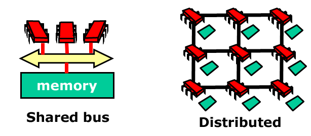


Revisiting Mutual Exclusion
###########################

When programming uniprocessors, one can generally ignore the exact structure and properties of the underlying system. Unfortunately, multiprocessor programming has yet to reach that state, and at present it is crucial that the programmer understand the properties and limitations of the underlying machine architecture. This will be our goal in this module. We revisit the familiar mutual exclusion problem, this time with the aim of devising mutual exclusion protocols that work well on today’s multiprocessors. Our goals are as follows:
	
	- Think of performance, not just correctness and progress

	- Begin to understand how performance depends on our software properly utilizing the multiprocessor machine’s hardware

	- Get to know a collection of locking algorithms

When You Can't Get a Lock
*************************

Any mutual exclusion protocol poses the question: what do you do if you cannot acquire the lock? There are two alternatives. If you keep trying, the lock is called a *spin lock*\ , and repeatedly testing the lock is called *spinning* or *busy-waiting*\ (we will use these terms interchangeably). The `filter`_ and `bakery`_ algorithms are spin-locks. Spinning is sensible when you expect the lock delay to be short. For obvious reasons, spinning makes sense only on multiprocessors. 

The alternative to spinning or busy-waiting is to suspend yourself and ask the operating system's scheduler to schedule another thread on your processor, which is sometimes called *blocking*\ . Java’s built-in synchronization is blocking. Because switching from one thread to another is expensive, blocking makes sense only if you expect the lock delay to be long. Many operating systems mix both strategies, spinning for a short time and then blocking.

.. _filter: http://en.wikipedia.org/wiki/Peterson's_algorithm#Filter_algorithm:_Peterson.27s_algorithm_for_N_processes
.. _bakery: http://en.wikipedia.org/wiki/Lamport's_bakery_algorithm#Algorithm

Spinlocks
`````````

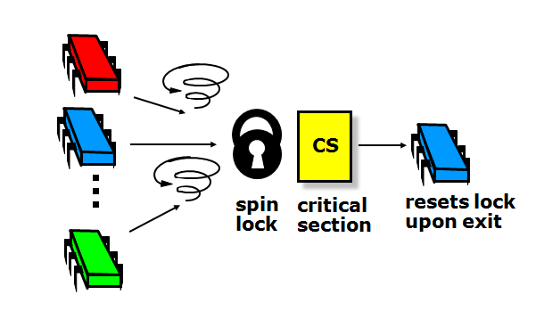

With spin locks, synchronization usually looks like this: some set of threads *contend* for the lock. One of them *acquires* it, and the others spin. The winner enters the critical section, does its job, and *releases* the lock on exit.

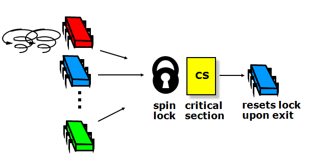

There is extra delay just to get through the lock itself: the lock introduces sequential bottleneck, effectively negating the parallelism.\

.. image:: images/spinlocks3.png
	:width: 550px
	:height: 338px
	:scale: 75%
	:alt: Basic spin lock, part 3.
	:align: center

The lock suffers from *contention*\ . Contention occurs when multiple threads try to acquire a lock at the same time. *High contention* means there are many such threads, and *low contention* means the opposite. 

Note that sequential bottleneck and contention are **distinct phenomena**\ . Our goal is to understand how contention works, and to develop a set of techniques that can avoid or alleviate it. These techniques provide a useful toolkit for all kinds of synchronization problems. We are not trying to resolve the sequential bottleneck in this module; we are only looking at ways to manage contention and busy-wait more efficiently.

Test-and-Set
````````````

The test-and-set machine instruction operates on a single memory word which holds a binary value (either true or false). ``testAndSet()`` atomically stores *true* in that word and returns the word's previous value, *swapping* the value *true* for the word's current value.  ``lock()`` calls ``testAndSet()`` until it returns false (thereby indicating that the lock was free); you can reset the word just by writing false to it. Note in Java TAS is called ``getAndSet()``\ , and we will use the terms interchangeably.

Here, we implement ``getAndSet()`` using Java's AtomicBoolean class, which is provided as part of Java’s standard library of atomic primitives and can be thought of as a box holding a Boolean value. ``getAndSet()`` swaps a Boolean value with the current contents of the box.

.. code-block:: java
	:linenos:

	public class AtomicBoolean {
		boolean value;
  
		public synchronized boolean getAndSet(boolean newValue) {
			boolean prior = value;
   			value = newValue;
   			return prior;
 		}
	}

At first, this seems ideal for implementing a spin lock. The lock is free when the word's value is false, and busy when it is true. If we call ``getAndSet(true)``\ , then we have a test-and-set. 

.. code-block:: java
	:linenos:

	AtomicBoolean lock = new AtomicBoolean(false)
	boolean prior = lock.getAndSet(true)

Here it is in more detail. The lock is just an ``AtomicBoolean`` initialized to false. The ``lock()`` method repeatedly applies ``testAndSet()`` to the location until that instruction returns false (that is, until the lock is free). The ``unlock()`` method simply writes the value false to that word. 

.. code-block:: java
	:linenos:

	class TASlock {
 		AtomicBoolean state = new AtomicBoolean(false);

 		void lock() {
  		while (state.getAndSet(true)) {}
 		}
 
 		void unlock() {
  		state.set(false);
 		}
 	} 

We call real world space complexity the “footprint”\, and by using ``testAndSet()`` we are able to reduce the footprint from linear (as in the filter and bakery locks) to constant. Because it uses an atomic `RMW`_ operation, an *n*\ -thread spinlock uses O(1) space.

Let’s do an experiment on a real machine. Take *n* threads and have them collectively acquire a lock, increment a counter, and release the lock. Have them do it collectively, say, one million times. Before we look at any curves, let’s try to reason about how long it *should* take them.

.. figure:: images/idealgraph.png
	:width: 240px
	:height: 168px
	:scale: 100%
	:figclass: align-center
	:alt: Graph showing how long TAS should take, in theory.

	Ideally the curve should stay flat. Why? Because we have a sequential bottleneck so no matter how many threads we add running in parallel, we will not get any speedup (remember `Amdahl`_’s law). 

.. figure:: images/actualgraph.png
	:width: 312px
	:height: 199px
	:scale: 95%
	:figclass: align-center
	:alt: Graph showing how long TAS actually takes.

	However, the curve for TAS lock looks like this. In fact, if you do the experiment you have to give up because it takes so long beyond a certain number of processors. What is happening? 

.. _Amdahl: http://en.wikipedia.org/wiki/Amdahl's_law

.. _RMW: http://en.wikipedia.org/wiki/Read%E2%80%93modify%E2%80%93write


Test-and-test-and-set
`````````````````````

Let’s try a slightly different approach. Instead of repeatedly trying to test-and-set the lock, let’s split the locking method into two phases. In the *lurking* phase, we wait until the lock looks like it’s free, spinning while read returns true. When it’s free, we *pounce*\ , attempting to acquire the lock by a call to test-and-set. If we win, we’re in, and if we lose, we go back to lurking. It looks like this:

.. code-block:: java
	:linenos:
	:emphasize-lines: 7,8

	class TTASlock {
 		AtomicBoolean state = new AtomicBoolean(false);

 		void lock() {
  			while (true) {
   				while (state.get()) {}
   				if (!state.getAndSet(true))
    			return;
 			}
		} 
	}

The highlighted lines are key steps: first we spin on the value, repeatedly reading it until it looks like the lock is free. We don’t try to modify it, we just read it. As soon as it looks like the lock is free, we call ``getAndSet(true)`` to try to acquire it. If we are first and we succeed, the ``lock()`` method returns, and otherwise, if someone else got there before us, we go back to lurking (repeatedly rereading the variable).

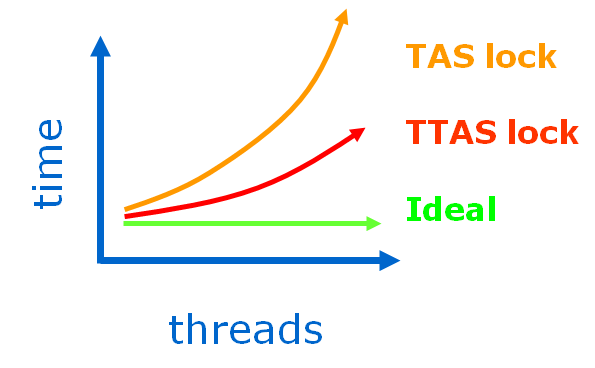

	The difference is dramatic. The TTAS lock performs much better than the TAS lock, but still much worse than we expected from an ideal lock. 

There are two mysteries here: why is the TTAS lock so good (that is, so much better than TAS), and why is it so bad (so much worse than ideal)?  

We would expect the TAS and TTAS locks to be the same - after all, they are *logically* equivalent programs. In fact, they are equivalent with respect to *correctness* (they both work), but very different with respect to performance. The problem here is that the shared memory abstraction is broken with respect to *performance* - we need a more detailed model. If you don’t understand the underlying architecture, you will never understand why your reasonable-looking programs are so slow.

Multiprocessor Architecture, part 2
###################################

We're going to do a more thorough review. Here is an example bus-based multiprocessor architecture.

.. image:: images/busbasedarch1.png
	:width: 619px
	:height: 375px
	:scale: 40%
	:alt: Bus-based architectures.
	:align: center

The processors share a memory that has a high latency (say, 50 to 100 cycles) to read or write a value. This means that while you are waiting for the memory to respond, you can execute that many instructions.

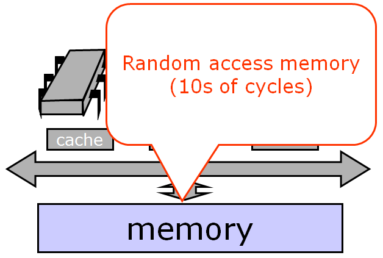

Processors communicate with the memory and with one another over a shared bus. The bus is a broadcast medium, meaning that only one processor at a time can send a message, although everyone can (and does!) passively listen.

.. image:: images/busbasedarch3.png
	:width: 634px
	:height: 452px
	:scale: 40%
	:alt: Bus-based architectures.
	:align: center

Each processor has a *cache*\ , a small high-speed memory where the processor keeps data likely to be of interest. A cache access typically requires one or two machine cycles, while a memory access typically requires many machine cycles. Technology trends are making this contrast more extreme: although both processor cycle times and memory access times are becoming faster, the cycle times are improving faster than the memory access times, so cache performance is critical to the overall performance of a multiprocessor architecture.

.. image:: images/busbasedarch4.png
	:width: 713px
	:height: 539px
	:scale: 40%
	:alt: Bus-based architectures.
	:align: center

If a processor finds data in its cache, then it doesn’t have to go all the way to memory. This is a very good thing, which we call a *cache hit*\ . If the processor doesn’t find what it wants in its cache, then we have a *cache miss*\ , which is very time-consuming. How well a synchronization protocol or concurrent algorithm performs is largely determined by its cache behavior: how many hits and misses.

Here is one thing that can happen when a processor issues a load request.

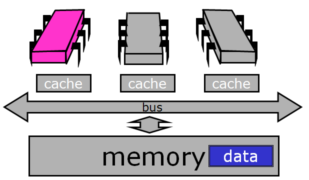

It broadcasts a message asking for the data it needs. Notice that while it is broadcasting, no one else can use the bus.

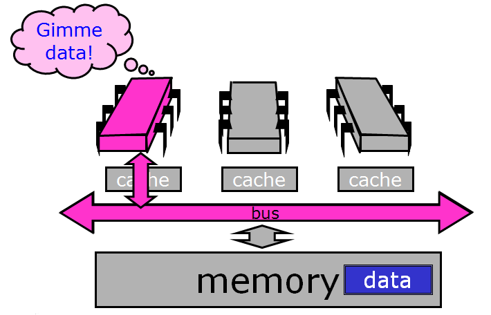

In this case, the memory responds to the request, also over the bus.

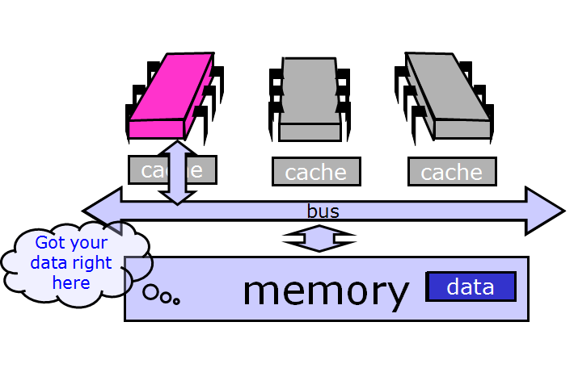

Now suppose another processor issues a load request for the same data.

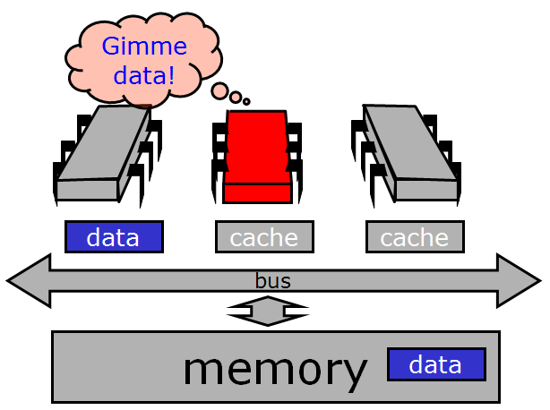

It broadcasts its request over the bus.

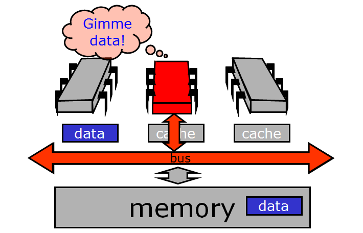

This time, however, the request is picked up by the first processor, which has the data in its cache. Usually, when a processor has the data cached, it, rather than the memory, will respond to load requests.

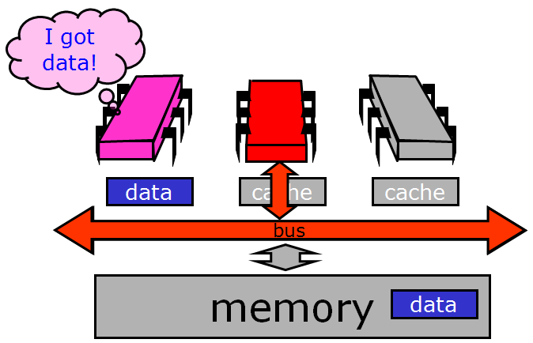

The processor puts the data on the bus.

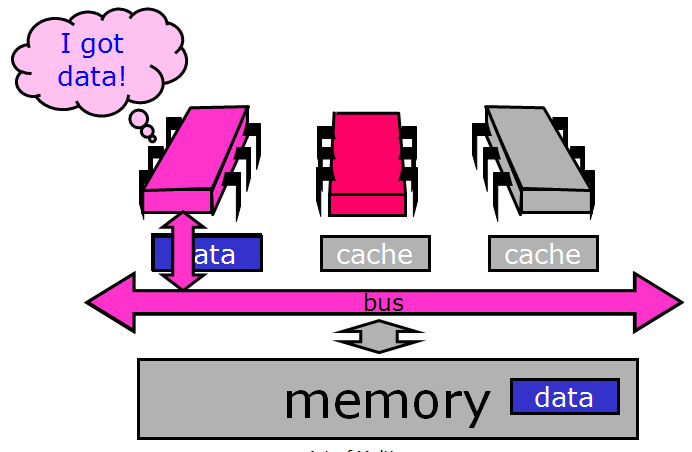

Now both processors have the same data cached.

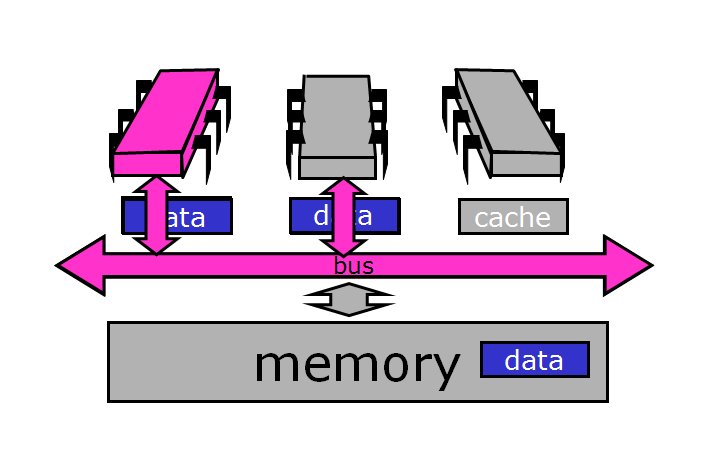

Now what happens if the red processor decides to modify the cached data?

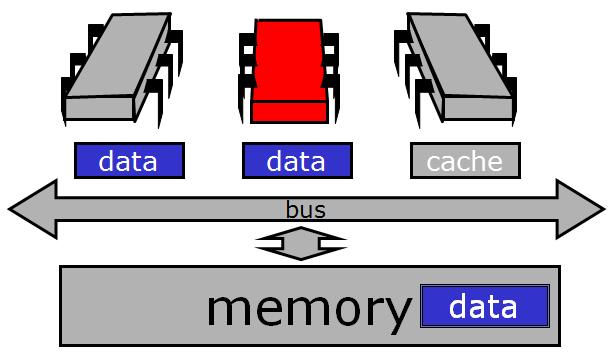

It changes the copy in its cache (from blue to white).

.. image:: images/datamodified2.png
	:width: 616px
	:height: 358px
	:scale: 40%
	:alt: Data modified.
	:align: center

Now we have a problem: the data cached at the red processor disagrees with the same copy of that memory location stored both at the other processors and in the memory itself.

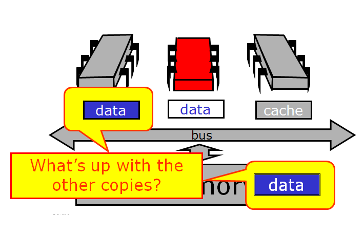

So now we have lots of copies of data: an original copy in memory and cached copies at processors. When one processor modifies its own copy, what do we do with the others? How do we avoid confusion? The problem of keeping track of multiple copies of the same data is called the cache coherence problem, and ways to accomplish it are called cache coherence protocols.

Warning: This is *still* a simplification. Real cache coherence protocols can be very complex. For example, modern multiprocessors have multi-level caches, where each processor has an on-chip level-one (L1) cache, and clusters of processors share a level-two (L2) cache. The L2 cache is on-chip in some modern architectures, and off chip in others, a detail that greatly changes the observed performance. We are going to avoid going into too much detail here, though, because the basic principles don't depend on that level of detail.

Write-Back Caches
*****************

One way to solve the problem is with a write-back coherence protocol. An invalidation message is sent out when the value is first modified, instructing the other processors to discard that value from their caches (a non-trivial protocol). Once the processor has invalidated the other cached values, it can make subsequent modifications without further bus traffic. A value that has been modified in the cache but not written back is called *dirty*\ . If the processor needs to use the cache for another value, or if another processor wants it, however, it must remember to write back any dirty values.

Cache entries therefore now have three states: invalid (contains raw seething bits!), valid (can read but not write), and dirty (data has been modified). If the cache is invalid, then its contents are meaningless. If it is valid, then the processor can read the value, but does not have permission to write it because it may be cached elsewhere. If the value is dirty, then the processor has modified the value and is intercepting other load requests for it.  It must be written back before that cache can be reused.

To see an example, let's rewind back to the moment when the red processor updated its cached data.

.. image:: images/cachecoherence1.png
	:width: 612px
	:height: 356px
	:scale: 40%
	:alt: Data modified.
	:align: center

It broadcasts an *invalidation* message warning the other processors to invalidate, or discard, their cached copies of that data.

.. image:: images/cachecoherence2.png
	:width: 616px
	:height: 460px
	:scale: 40%
	:alt: Data modified.
	:align: center

When the other processors hear the invalidation message, they set their caches to the *invalid* state.

.. image:: images/cachecoherence3.png
	:width: 690px
	:height: 450px
	:scale: 40%
	:alt: Data modified.
	:align: center

From this point on, the red processor can update that data value without causing any bus traffic, because it knows that it has the only cached copy. This is much more efficient than a write-through cache because it produces much less bus traffic.

.. image:: images/cachecoherence4.png
	:width: 744px
	:height: 464px
	:scale: 40%
	:alt: Data modified.
	:align: center

Finally, there is no need to update memory until the processor wants to use that cache space for something else. Any other processor that asks for the data will get it from the red processor.

.. image:: images/cachecoherence5.png
	:width: 652px
	:height: 368px
	:scale: 40%
	:alt: Data modified.
	:align: center

If another processor wants the data, it asks for it over the bus.

.. image:: images/cachecoherence6.png
	:width: 614px
	:height: 372px
	:scale: 40%
	:alt: Data modified.
	:align: center

And the owner responds by sending the data over.

.. image:: images/cachecoherence7.png
	:width: 610px
	:height: 446px
	:scale: 40%
	:alt: Data modified.
	:align: center

That leaves us here.

.. image:: images/cachecoherence8.png
	:width: 688px
	:height: 378px
	:scale: 40%
	:alt: Data modified.
	:align: center

Note that optimizing a spin lock is not a simple question, because we have to figure out exactly what we want to optimize: whether it’s the bus bandwidth used by spinning threads, the latency of lock acquisition or release, or whether we mostly care about uncontended locks.

Solving the Mystery
*******************

We now consider how the simple test-and-set algorithm performs using a bus-based write-back cache (the most common case in practice). Each ``testAndSet()`` call goes over the bus, and since all of the waiting threads are continually using the bus, all threads, even those not waiting for the lock, must wait to use the bus for each memory access. Even worse, the test-and-set call invalidates all cached copies of the lock, so every spinning thread encounters a cache miss almost every time, and has to use the bus to fetch the new, but unchanged value. Adding insult to injury, when the thread holding the lock tries to release it, it may be delayed waiting to use the bus that is monopolized by the spinners. We now understand why the TAS lock performs so poorly.

Now consider the behavior of the TTAS lock algorithm while the lock is held by a thread A. The first time thread B reads the lock it takes a cache miss, forcing B to block while the value is loaded into B's cache. As long as A holds the lock, B repeatedly rereads the value...but each time, B hits in its cache (finding the desired value). B thus produces no bus traffic, and does not slow down other threads' memory accesses. Moreover, a thread that releases a lock is not delayed by threads spinning on that lock. However, there is a problem when the lock is released: false is written to the lock variable, which invalidates all of the cached copies. Each thread then takes a cache miss, rereads the new value, or calls ``getAndSet()`` more or less simultaneously, producing a storm of bus traffic.

Again, let's break it down visually. While the lock is held, all the contenders spin in their caches, rereading cached data without causing any bus traffic.

.. image:: images/localspinning1.png
	:width: 612px
	:height: 360px
	:scale: 40%
	:alt: Local spinning.
	:align: center

Things deteriorate, however, when the lock is released. The lock holder releases the lock by writing false to the lock variable…

.. image:: images/localspinning2.png
	:width: 612px
	:height: 354px
	:scale: 40%
	:alt: Local spinning.
	:align: center

… which immediately invalidates the spinners' cached copies. Each one takes a cache miss, rereads the new value...

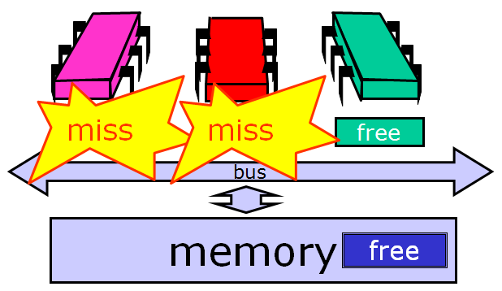

and they all (more-or-less simultaneously) call test-and-set to acquire the lock. The first to succeed invalidates the others, who must then reread the value, causing a storm of bus traffic. 

.. image:: images/allcalltas.png
	:width: 610px
	:height: 358px
	:scale: 40%
	:alt: Everyone calls TAS.
	:align: center

Eventually, the processors quiesce or settle down once again to local spinning (this could explain why the TTAS lock takes longer than the ideal lock). So how long does this take?

Measuring Quiescence Time
`````````````````````````

.. image:: images/andersonexper.png
	:width: 622px
	:height: 200px
	:scale: 90%
	:alt: Quiescence experiment.
	:align: center

This is the classical experiment conducted by Anderson. We decrease **X** until the bus-intensive operations in **Y** interleave with the quiescing of the lock release operation, at which point we will see a drop in throughput or an increase in latency. 

In the critical section, ops X run, then ops Y. As long as quiescence time is less than X, there is no drop in performance. By gradually varying X, can determine the exact time to quiesce.


Quiescence time for TTAS is shown below, alone...


...and in comparison to both TAS and the ideal graph.

.. image:: images/ttascompgraph.png
	:width: 604px
	:height: 448px
	:scale: 40%
	:alt: Quiescence experiment results.
	:align: center

So now we understand why the TTAS lock performs much better than the TAS lock, but still much worse than an ideal lock. Mystery explained!
