******************************************
Solving the Mystery and Using Our Findings
******************************************

In the last section, we observed that the logically equivalent TAS and TTAS locks, two ways to implement a spinlock, differ dramatically with respect to actual performance (and neither approaches what we thought the ideal timing should look like). To solve the mystery of why this might be, we've been looking more thoroughly at multiprocessor architecture. We'll begin with exploring one cache coherence protocol.

Write-Back Caches
#################

In a write-back coherence protocol, an invalidation message is sent out when the value is first modified, instructing the other processors to discard that value from their caches (a non-trivial protocol). Once the processor has invalidated the other cached values, it can make subsequent modifications without further bus traffic. A value that has been modified in the cache but not written back is called *dirty*\ . If the processor needs to use the cache for another value, or if another processor wants it, however, it must remember to write back any dirty values.

Cache entries therefore now have three states: invalid (contains raw seething bits!), valid (can read but not write), and dirty (data has been modified). If the cache is invalid, then its contents are meaningless. If it is valid, then the processor can read the value, but does not have permission to write it because it may be cached elsewhere. If the value is dirty, then the processor has modified the value and is intercepting other load requests for it.  It must be written back before that cache can be reused.

To see an example, let's rewind back to the moment when the red processor updated its cached data.

.. image:: images/cachecoherence1.png
	:width: 612px
	:height: 356px
	:scale: 40%
	:alt: Data modified.
	:align: center

It broadcasts an *invalidation* message warning the other processors to invalidate, or discard, their cached copies of that data.

.. image:: images/cachecoherence2.png
	:width: 616px
	:height: 460px
	:scale: 40%
	:alt: Data modified.
	:align: center

When the other processors hear the invalidation message, they set their caches to the *invalid* state.

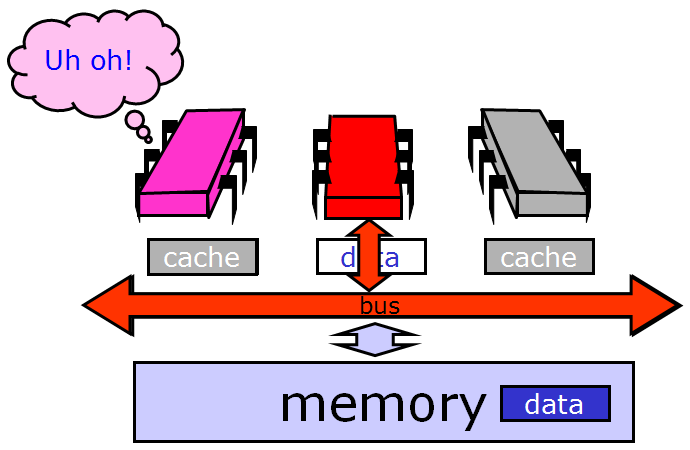

From this point on, the red processor can update that data value without causing any bus traffic, because it knows that it has the only cached copy. This is much more efficient than a write-through cache because it produces much less bus traffic.

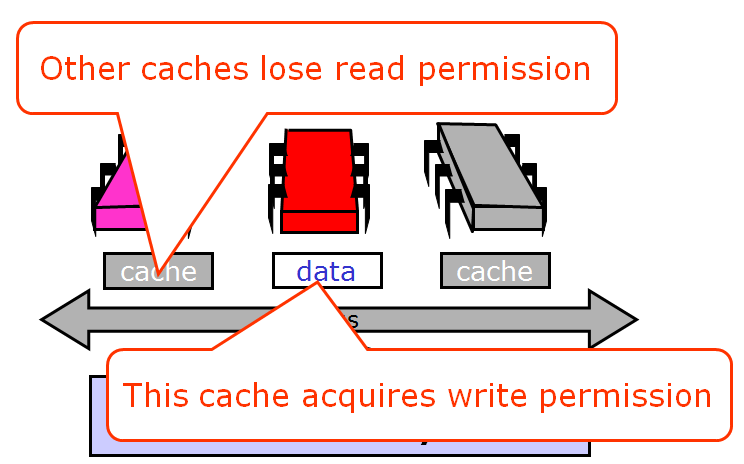

Finally, there is no need to update memory until the processor wants to use that cache space for something else. Any other processor that asks for the data will get it from the red processor.

.. image:: images/cachecoherence5.png
	:width: 652px
	:height: 368px
	:scale: 40%
	:alt: Data modified.
	:align: center

If another processor wants the data, it asks for it over the bus.

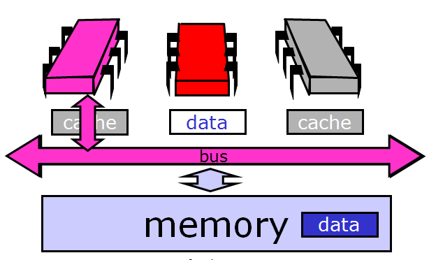

And the owner responds by sending the data over.

.. image:: images/cachecoherence7.png
	:width: 610px
	:height: 446px
	:scale: 40%
	:alt: Data modified.
	:align: center

That leaves us here.

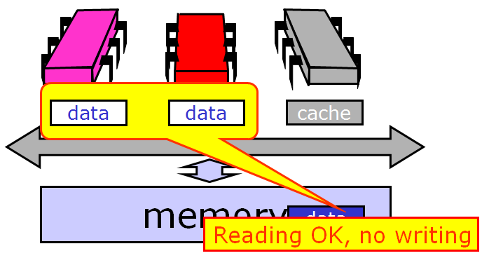

Note that optimizing a spin lock is not a simple question, because we have to figure out exactly what we want to optimize: whether it’s the bus bandwidth used by spinning threads or the latency of lock acquisition or release, or whether we mostly care about uncontended locks.

Solving the Mystery
###################

We now consider how the simple test-and-set algorithm performs using a bus-based write-back cache (the most common case in practice). Each ``testAndSet()`` call goes over the bus, and since all of the waiting threads are continually using the bus, all threads, even those not waiting for the lock, must wait to use the bus for each memory access. Even worse, the TAS call invalidates all cached copies of the lock, so every spinning thread encounters a cache miss almost every time and has to use the bus to fetch the new but unchanged value. Adding insult to injury, when the thread holding the lock tries to release it, it may be delayed waiting to use the bus that is monopolized by the spinners. We now understand why the TAS lock performs so poorly.

Now consider the behavior of the TTAS lock algorithm while the lock is held by a thread A. The first time thread B reads the lock it takes a cache miss, forcing B to block while the value is loaded into B's cache. As long as A holds the lock, B repeatedly rereads the value...but each time, B hits in its cache (finding the desired value). B thus produces no bus traffic, and does not slow down other threads' memory accesses. Moreover, a thread that releases a lock is not delayed by threads spinning on that lock. However, there is a problem when the lock is released: *false* is written to the lock variable, which invalidates all of the cached copies. Each thread then takes a cache miss, rereads the new value, and calls ``getAndSet()`` more or less simultaneously, producing a storm of bus traffic.

Again, let's break it down visually. While the lock is held, all the contenders spin in their caches, rereading cached data without causing any bus traffic.

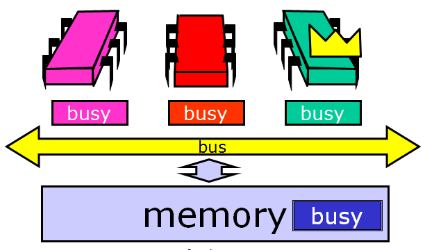

Things deteriorate, however, when the lock is released. The lock holder releases the lock by writing false to the lock variable…

.. image:: images/localspinning2.png
	:width: 612px
	:height: 354px
	:scale: 40%
	:alt: Local spinning.
	:align: center

… which immediately invalidates the spinners' cached copies. Each one takes a cache miss, rereads the new value...

.. image:: images/allmiss.png
	:width: 612px
	:height: 358px
	:scale: 40%
	:alt: Everyone takes a cache miss.
	:align: center

and they all (more or less simultaneously) call test-and-set to acquire the lock. The first to succeed invalidates the others, who must then reread the value, causing a storm of bus traffic. 

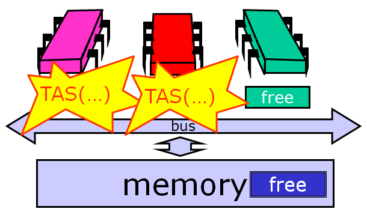

Eventually, the processors *quiesce* or settle down once again to local spinning. So now we understand why the TTAS lock performs much better than the TAS lock, but still much worse than an ideal lock. Mystery explained!

Backoff Locks
#############

To motivate an improvement on the TTAS lock algorithm, we review how it works: test the lock until it appears to be free, then pouncing with TAS. It seems logical to conclude that if another thread manages to acquire the lock between those two steps that it is under high contention and therefore unwise to continue trying to acquire immediately. Instead, it makes more sense to *back off* for some period of time.

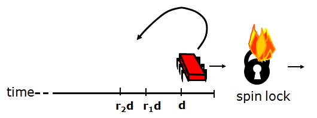

For how long should the thread back off before retrying? A good rule of thumb is that the larger the number of unsuccessful tries, the higher the likely contention, and the longer the thread should back off. Here is a simple approach. Whenever the thread sees the lock has become free but fails to acquire it, it backs off before retrying. To ensure that concurrent conflicting threads do not fall into "lockstep", all trying to acquire the lock at the same time, the thread backs off for a random duration. Each time the thread tries and fails to get the lock, it doubles the expected time it backs off, up to a fixed maximum.

.. image:: images/backoff2.png
	:width: 526px
	:height: 212px
	:scale: 60%
	:alt: Length of backoff.
	:align: center

Here is an implementation of such a lock. The constant MIN_DELAY indicates the initial, shortest limit (it makes no sense for the thread to back off for too short a duration). 

.. code-block:: java
	:linenos:

	public class Backoff implements lock { 
	public void lock() {
		int delay = MIN_DELAY;
		while (true) {
			while (state.get()) {}
			if (!lock.getAndSet(true))
				return;
			sleep(random() % delay);
			if (delay < MAX_DELAY)
				delay = 2 * delay;
			}
		}
	}  

As in the TTAS algorithm, the thread spins testing the lock until the lock appears to be free. Then the thread tries to acquire the lock. If it fails, then it computes a random delay between zero and the current limit and then sleeps for that delay before retrying.

It doubles the limit for the next back-off, up to MAX_DELAY. It is important to note that the thread backs off only when it fails to acquire a lock that it had immediately before observed to be free. Observing that the lock is held by another thread says nothing about the level of contention.

The graph below shows that the backoff lock outperforms the TTAS lock, though it is far from the ideal curve (which is flat). The slope of the backoff curve varies greatly from one machine to another, but is invariably better than that of a TTAS lock.

.. image:: images/backofftiming.png
	:width: 632px
	:height: 360px
	:scale: 40%
	:alt: Length of backoff.
	:align: center

The backoff lock is easy to implement, and on many architectures performs significantly better than TTAS lock. Unfortunately, its performance is sensitive to the choice of minimum and maximum delay constants. To deploy this lock on a particular architecture, it is easy to experiment with different values, and choose the ones that work best. Experience shows, however, that these optimal values are sensitive to the number of processors and their speed, so it is not easy to tune the back-off lock class to be portable across a range of different machines.

Queue Locks
###########

We now explore a different approach to implementing spin locks, one that is a little more complicated than backoff locks, but inherently more portable. One can overcome these drawbacks by having threads form a line, or queue. In a queue, each thread can learn if its turn has arrived by checking whether its predecessor has been served. Invalidation traffic is reduced by having each thread spin on a different location. A queue also allows for better utilization of the critical section since there is no need to guess when to attempt to access it: each thread is notified directly by its predecessor in the queue. Finally, a queue provides first-come-first-served fairness, the same high level of fairness achieved by the `bakery`_ algorithm. We now explore different ways to implement queue locks, a family of locking algorithms that exploit these insights.

Here is the Anderson queue lock, a simple array-based queue lock. The threads share an atomic integer tail field, initially zero. To acquire the lock, each thread atomically increments the tail field. Call the resulting value the thread's slot. The slot is used as an index into a Boolean flag array. If ``flag[j]`` is true, then the thread with slotj has permission to acquire the lock. Initially, ``flag[0]`` is true.

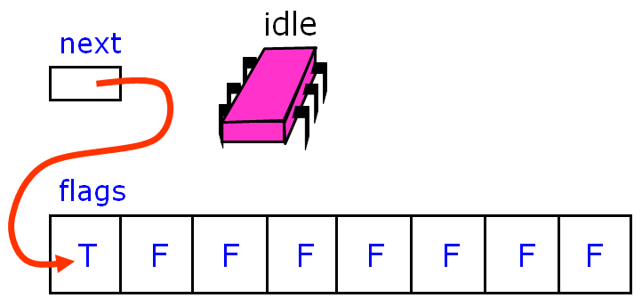

To acquire the lock, each thread atomically increments the tail field. We'll call the resulting value the thread's slot.

.. image:: images/andlock2.png
	:width: 722px
	:height: 344px
	:scale: 40%
	:alt: Timing of queue lock.
	:align: left

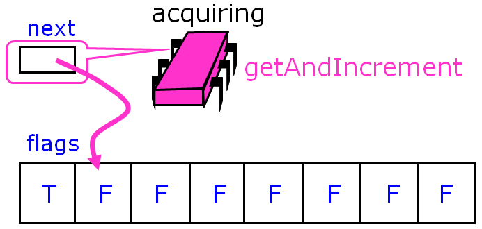

.. image:: images/placeholder.png
	:width: 86px
	:height: 16px
	:scale: 100%
	:align: center

The slot is used as an index into a Boolean flag array. If ``flag[j]`` is true, then the thread with slot *j* has permission to acquire the lock. Initially, ``flag[0]`` is true. To acquire the lock, a thread spins until the flag at its slot becomes true.

.. image:: images/andlock4.png
	:width: 680px
	:height: 340px
	:scale: 40%
	:alt: Timing of queue lock.
	:align: center

Here another thread wants to acquire the lock.

.. image:: images/andlock5.png
	:width: 676px
	:height: 342px
	:scale: 40%
	:alt: Timing of queue lock.
	:align: center
 
It applies get-and-increment to the next pointer...

.. image:: images/andlock6.png
	:width: 696px
	:height: 348px
	:scale: 40%
	:alt: Timing of queue lock.
	:align: center

...and advances the next pointer to acquire its own slot.

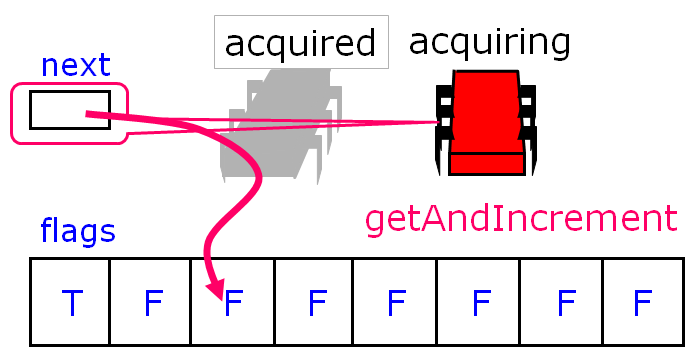

Then it spins until the flag variable at that slot becomes true.

.. image:: images/andlock8.png
	:width: 678px
	:height: 380px
	:scale: 40%
	:alt: Timing of queue lock.
	:align: center

The first thread releases the lock by setting the next slot to true.

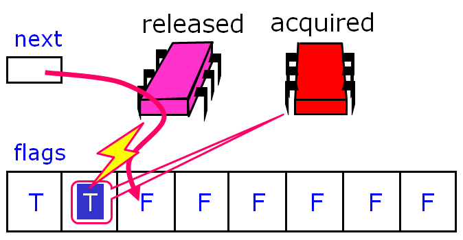

The second thread notices the change, and enters its critical section.

.. image:: images/andlock10.png
	:width: 730px
	:height: 336px
	:scale: 40%
	:alt: Timing of queue lock.
	:align: center

Here is an implementation of the Anderson queue lock.	

.. code-block:: java
	:linenos:

	public class ALock implements Lock {
		boolean[] flags= {true,false,...,false}; //one flag per thread
		AtomicInteger next = new AtomicInteger(0); //next field tells us which flag to use
		//each thread has a thread-local variable that keeps track of its slot 
		//(that is, each thread has a private instance of mySlot
		//shared only by name and not reference)
		ThreadLocal<Integer> mySlot; 
	}

We have one flag per thread, which means we have to know how many threads there are - there are *N* flags because you never expect to see more than *N* threads (each in line waiting for the lock). Unlike the `bakery`_ and `Peterson filter`_ algorithms, the flags are multi-reader and multi-writer, so a thread does not have an exclusive location in the flag array. Rather, a thread calls get-and-increment to get an assigned slot. It then spins on its assigned slot until the value is true.

Bus traffic, then, is greatly reduced as each thread spins on a locally cached copy of a single array location - contention on the flags is minimized and invalidation traffic is low as well. However, contention may still occur due to *false sharing*: cache memory is not stored as individual items but as multiword lines, and adjacent data items like array elements frequently share lines. When one flag is changed, it will invalidate its entire cache line, which may include nearby unchanged items. One way around this problem is to *pad* array elements so that each element is mapped to a distinct cache line (for example, with a cache of four-word lines, we can increase the lock array size fourfold and moving from location *i* to next location 4(*i* + 1) mod 32 rather than *i* + 1 mod 8.

Here is the code for the lock and unlock methods: if I'm a thread, first, I claim a slot by atomically incrementing the next field. Next, I wait until my predecessor has released the lock. I reset my slot to false so that it can be used the next time around. To release the lock, I set the slot after mine to true, being careful to wrap around.

.. code-block:: java
	:linenos:

	public lock() {
		int mySlot = next.getAndIncrement(); //take next slot
		while (!flags[mySlot % n]) {}; //spin until told where to go
		flags[mySlot % n] = false; //prepare slot for reuse
	}

	public unlock() {
		flags[(mySlot+1) % n] = true; //tell next thread to go
	}

The Anderson queue lock improves on backoff locks because it reduces invalidations to a minimum and schedules access to the critical section tightly, minimizing the interval between when a lock is freed by one thread and when is acquired by another. There is also a theoretical benefit: unlike the TTAS and backoff lock, this algorithm guarantees that there is no lockout, and in fact, provides first-come-first-served fairness, which we actually lose in TTAS and TTAS with backoff. 

.. image:: images/queuegraph.png
	:width: 334px
	:height: 260px
	:scale: 50%
	:alt: Timing of queue lock.
	:align: center

The Anderson lock is the first truly scalable lock we've examined so far, and is simple and easy to implement. However, the Anderson lock has two disadvantages. First, it is not space-efficient; it requires knowing a bound *N* on the maximum number of concurrent threads, and it allocates an array of that size per lock (one bit per thread). Thus, *L* locks will require *O(LN)* space even if a thread accesses only one lock at a given time. Second, the lock is poorly suited for uncached architectures, since any thread may end up spinning on any array location, and in the absence of caches, spinning on a remote location may be very expensive.

.. _bakery: http://en.wikipedia.org/wiki/Lamport's_bakery_algorithm#Algorithm
.. _Peterson filter: http://en.wikipedia.org/wiki/Peterson's_algorithm#Filter_algorithm:_Peterson.27s_algorithm_for_N_processes
