.. role:: uline

************************
A Second Helping of Soup
************************

In this final section, we examine 

The CLH Lock
############

The CLH queue lock (by Travis Craig, Anders Landin, and Erik Hagersten - many of these algorithms are named for their creators) is much more space-efficient since it incurs a small constant-size overhead per thread. It also provides FIFO fairness.

This algorithm records each thread's status in a QNode object, which has a Boolean locked field. If that field is true, then the corresponding thread either has acquired the lock or is waiting for the lock. If that field is false, then the thread has released the lock. The lock itself is represented as a virtual linked list of QNode objects. We use the term "virtual" because the list is implicit: each thread points to its predecessor through a thread-local ``predvariable``\ . The public tail variable points to the last node in the queue.

.. image:: images/clh1to3.png
	:width: 1515px
	:height: 432px
	:scale: 40%
	:alt: CLH
	:align: center

To acquire the lock, a thread sets the locked field of its QNode to true, meaning that the thread is not ready to release the lock.

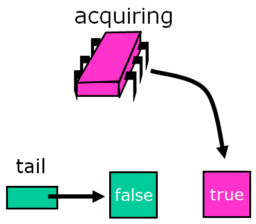

The thread applies swap to the tail to make its own node the tail of the queue, simultaneously acquiring a reference to its predecessor's QNode.

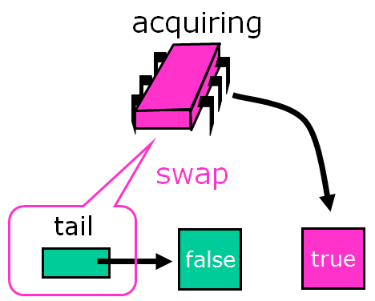

Because it sees that its predecessor’s QNode is false, this thread now has the lock.

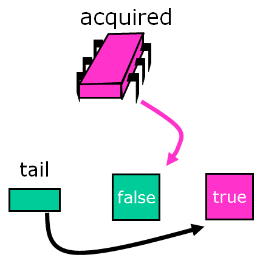

Another thread that wants the lock does the same sequence of steps …

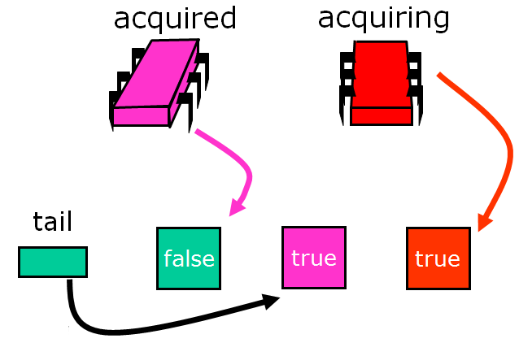

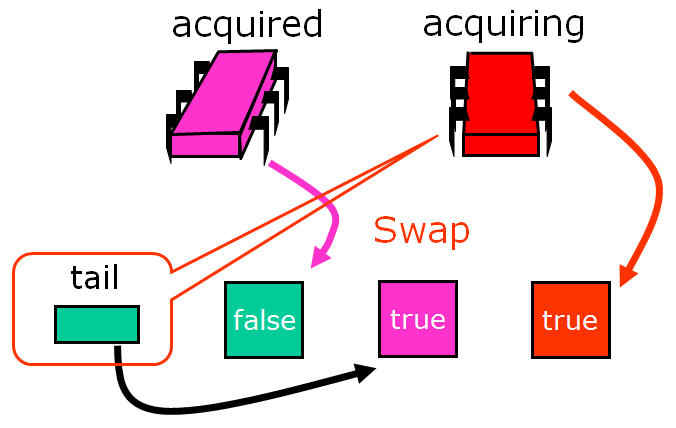

Note that the list is ordered implicitly - there are no real pointers between the nodes.

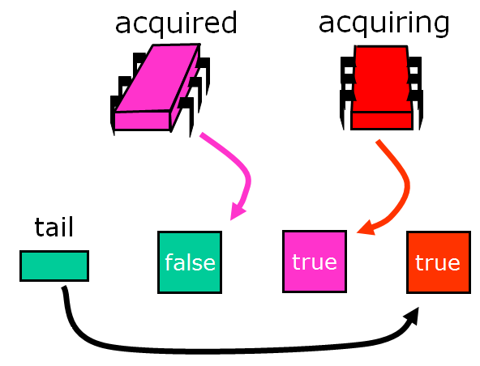

But each thread keeps a reference of the node it added to the list. So each thread has the node it was assigned from the swap and the reference to the node it added when the swap completed.

.. image:: images/clh10.png
	:width: 578px
	:height: 458px
	:scale: 40%
	:alt: CLH
	:align: center

Again, the links are implicit, as shown below.

.. image:: images/clh11.png
	:width: 754px
	:height: 444px
	:scale: 40%
	:alt: CLH
	:align: center

The waiting thread then spins on its predecessor's QNode until the predecessor releases the lock. 

.. image:: images/clh12.png
	:width: 580px
	:height: 486px
	:scale: 40%
	:alt: CLH
	:align: center

The thread actually spins on a *cached* copy of purple's node. This is very efficient in terms of interconnect traffic (unless you are on a NUMA architecture, where purple's node may be on a different processor).

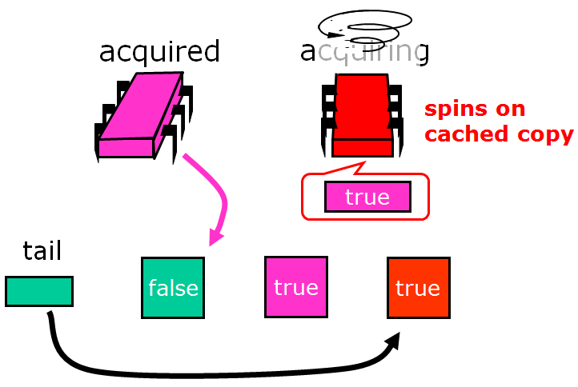

Some coherence protocols shared memory might not be updated at all, only the cached copy. This is very efficient. 

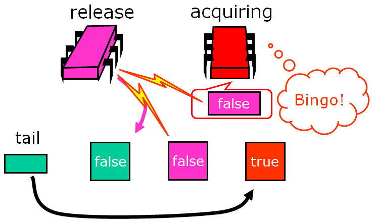

When a thread acquires a lock it can reuse its predecessor's QNode as its new node for future lock accesses. Note that it can do so since at this point the thread's predecessor's QNode will no longer be used by the predecessor, and the thread's old QNode is pointed to either by the thread's successor or by the tail. 

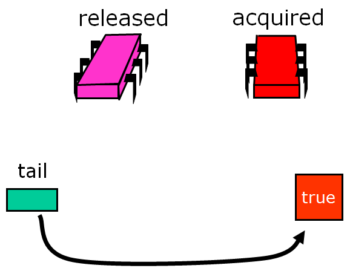

The reuse of the QNode's means that for *L* locks and *N* threads, if each thread accesses at most one lock at a time, we only need O(\ *L*\ +\ *N*\ ) space as compared with  O(\ *LN*\ ) for the ALock. Of course, this only holds for accessing one lock at a time. If you access all *L* locks, then you need a QNode for each access.

Here is what the code looks like as a Java object: if the locked field is true, the lock has not been released yet (it may also not have been acquired yet either).

.. code-block:: java
	:linenos:

	class Qnode {
		AtomicBoolean locked = new AtomicBoolean(true);
	} 

And here is the code for the lock:

.. code-block:: java
	:linenos:

	class CLHLock implements Lock {
		AtomicReference<Qnode> tail; //tail of the queue
		ThreadLocal<Qnode> myNode = new Qnode();
		//recall that ThreadLocal means that each thread has a private 
		//instance of myNode, shared only by name and not reference)
		public void lock() {
			Qnode pred = tail.getAndSet(myNode); //swap in myNode
			while (pred.locked) {} //spin until predecessor releases lock
		}

		public void unlock() {
			myNode.locked.set(false); //notify successor
			myNode = pred; //recycle predecessor's node
			//(notice that we don't actually reuse myNode in lock())
		}
	}

Like the ALock, this algorithm has each thread spin on a distinct location, so when one thread releases its lock, it invalidates its successor's cache only, and does not invalidate any other thread's cache. It does so with a lower space overhead, and, importantly, without requiring prior knowledge of the number of threads accessing a lock. It also provides first-come-first-served fairness. 

To understand the principal disadvantage of this lock algorithm, we need to know a little more about non-uniform memory (NUMA) architectures. NUMA architectures tend to be described as if they have flat shared memory, but the truth is that not all have caches, and some regions of memory are faster than others. The principal disadvantage of the CLHLock algorithm is that it performs poorly on cacheless NUMA architectures -   each thread spins waiting for its predecessors' nodes to become false. If this memory location is remote, then performance will suffer. 

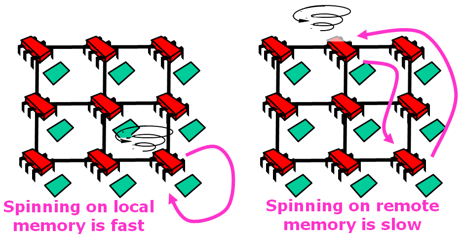

On cache-coherent architectures, however, this approach should work well.

MCS Lock
########

The MCS lock is another kind of queue lock that ensures that processes always spin on a fixed location in local memory, so this one works well for cacheless architectures. Like the CLH lock, it uses only a small fixed-size overhead per thread. It also provides FIFO fairness.

Here, too, the lock is represented as a linked list of QNodes, where each QNode represents either a lock holder or a thread waiting to acquire the lock. Unlike the CLH lock, the list is explicit, not virtual.

.. image:: images/mcs1.png
	:width: 424px
	:height: 360px
	:scale: 40%
	:alt: MCS
	:align: center

To acquire the lock, a thread places its own QNode at the tail of the list.

.. image:: images/mcs2.png
	:width: 662px
	:height: 354px
	:scale: 40%
	:alt: MCS
	:align: center

The node then swaps in a reference to its own QNode.

.. image:: images/mcs3.png
	:width: 678px
	:height: 356px
	:scale: 40%
	:alt: MCS
	:align: center

At this point the swap is completed, and the queue variable points to the tail of the queue.

.. image:: images/mcs4.png
	:width: 652px
	:height: 402px
	:scale: 40%
	:alt: MCS
	:align: center

To acquire the lock, a thread places its own QNode at the tail of the list. If there are no other QNodes on the list, it looks like this.

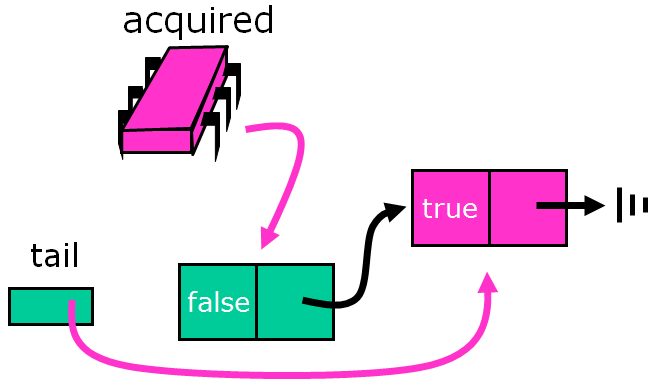

If a thread trying to acquire the lock has a predecessor, it modifies the predecessor's node to refer back to its own QNode.

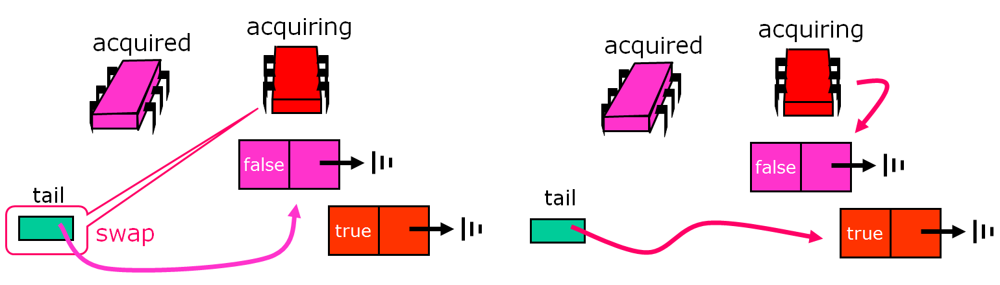

The predecessor's node now refers to the red processor's QNode.

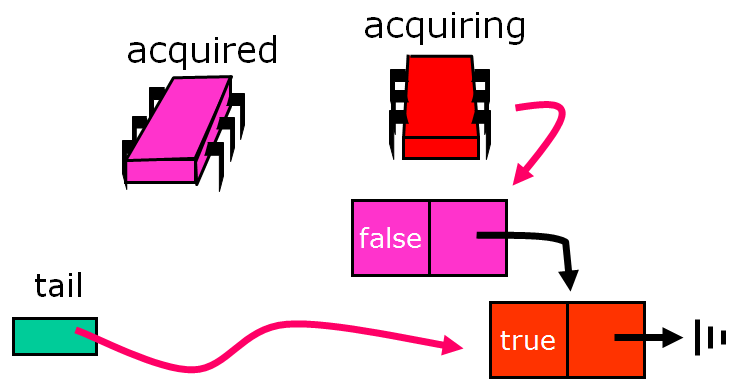

The red processor now spins locally, waiting for its turn.

.. image:: images/mcs9.png
	:width: 728px
	:height: 440px
	:scale: 40%
	:alt: MCS
	:align: center

The purple node is the first node, and it finds the lock free, so its flag is already set to true (default on creation).

.. image:: images/mcs10.png
	:width: 728px
	:height: 434px
	:scale: 40%
	:alt: MCS
	:align: center

The red processor acquires the lock!

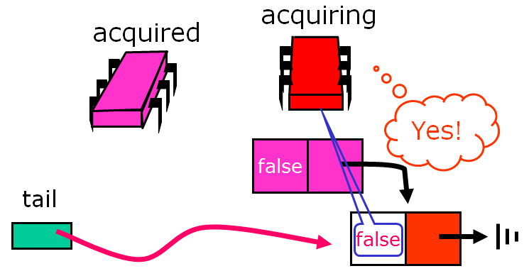

So now that we understand how it works, let's take a look at the code. Here is the code for QNodes:

.. code-block:: java
	:linenos:

	class Qnode {
		boolean locked = false;
		Qnode next = null;
	}

And here is the code that uses the QNode to implement an MCSLock:

.. code-block:: java
	:linenos:

	class MCSLock implements Lock {
		AtomicReference tail;
		public void lock() {
			Qnode qnode = new Qnode(); //qnode should be a thread-local variable!
			//we'll need it in the unlock method.
			Qnode pred = tail.getAndSet(qnode); //add my node to the tail of queue
			if (pred != null) {
				qnode.locked = true;
				pred.next = qnode;
				while (qnode.locked) {} //wait until unlocked
			}
		}
	}

The only way the CAS will fail is if someone has changed the tail. The fact that the tail has now changed suggests that someone else is trying to acquire the lock, and we need to wait for them to set the next pointer.

.. code-block:: java
	:linenos:

	public void unlock() {
		if (qnode.next == null) { //no successor?
			if (tail.CAS(qnode, null) //if really no successor, return
			return;
			while (qnode.next == null) {} //Otherwise wait for successor to catch up
			}
		qnode.next.locked = false; //pass lock to successor
		}
	}

We'll unpack unlocking with some more images. We left off here:

.. image:: images/mcsunlock1.png
	:width: 664px
	:height: 336px
	:scale: 40%
	:alt: MCS
	:align: center

The purple node looks at the queue.

.. image:: images/mcsunlock2.png
	:width: 664px
	:height: 438px
	:scale: 40%
	:alt: MCS
	:align: center

Red prepares to spin...

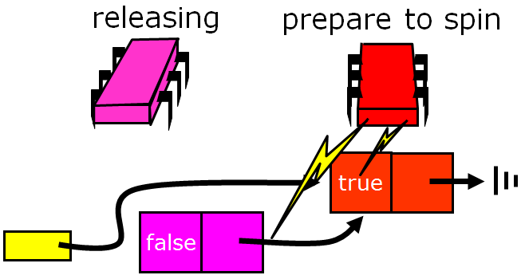

.. image:: images/mcsunlock4.png
	:width: 662px
	:height: 346px
	:scale: 40%
	:alt: MCS
	:align: center

...and then spins!

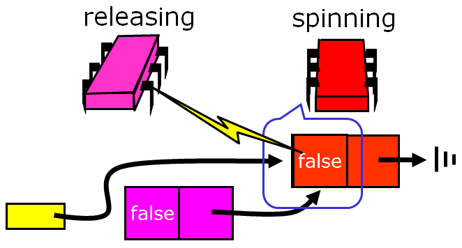

And red has acquired the lock!

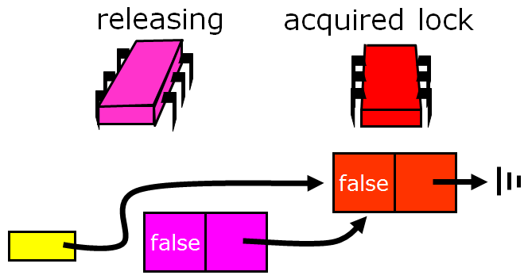
	
A Final Real-World Complication: Aborting Threads
#################################################

The spinlock constructions we've looked at some far provide first-come-first-served (FIFO) access with little contention, making them useful in many applications. In `real-time systems`_, however, threads may require the ability to *abort*, canceling a pending request to acquire a lock in order to meet some other real-time deadline. Example reasons for giving up waiting for a lock could include a tiemout or a database transaction aborted by the user. Let's look at implementing the option to abort on the locks we've examined so far:

Aborting a :uline:`backoff lock` request is trivial: if the request takes too long, simply return from the ``lock()`` method. The lock's state is unaffected by any thread's abort. A nice property of this lock is that the abort itself is immediate: it is wait-free, requiring only a constant number of steps, and there is no cleanup.

The :uline:`queue lock` is a little trickier, though: if we simply quit, the next thread in line will starve. 

Under normal circumstances, recall, the queue lock works like this:

.. image:: images/normalqueue.gif
	:width: 750px
	:height: 316px
	:scale: 40%
	:alt: normal queue behavior.
	:align: center

However, if we try to have a node in the middle abort, the subsequent threads run into problems:

.. image:: images/abortqueue.gif
	:width: 750px
	:height: 316px
	:scale: 40%
	:alt: queue with an aborting node
	:align: center
	
Instead, to create a CLHLock that can abort, we need a graceful way out. Removing a node in a wait-free manner from the middle of the list is difficult if we want that thread to reuse its own node. The initial state would look like this:

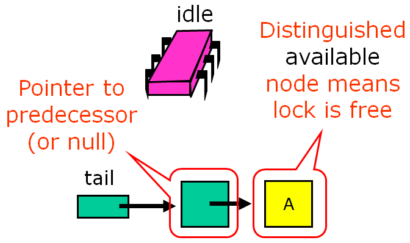

The idling purple processor decides it wants to acquire the lock:

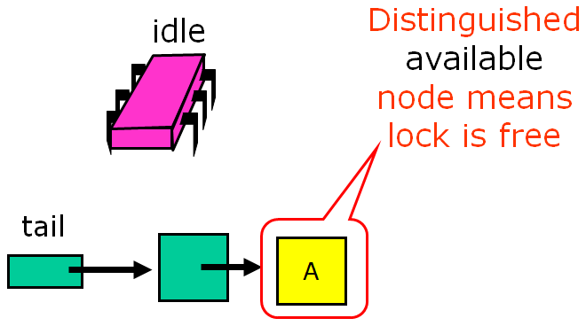

Each thread allocates a new QNode for each lock access. A Null predecessor value means that the QNode is not aborted and has not yet completed executing the critical section.

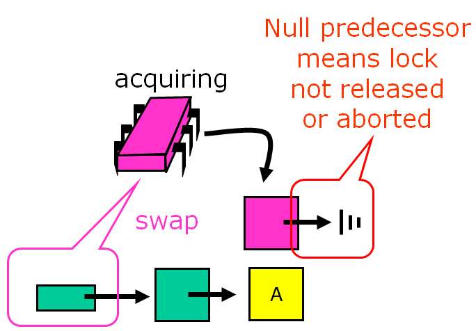

The purple predecessor can now acquire the lock:

.. image:: images/clhabort4.png
	:width: 478px
	:height: 384px
	:scale: 40%
	:alt: clh with abort, acquiring
	:align: center

Success, but it took a lot of work.

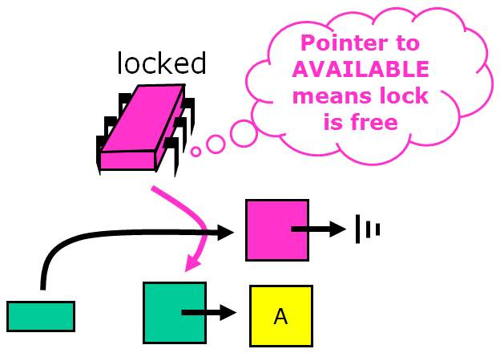

Instead, what if we let the successor deal with the recycling? Here we'll see a CLH lock in which the aborting thread marks the node so that the successor in the list will reuse the abandoned node and wait for that node's predecessor - the Timeout Lock.

.. image:: images/to1.png
	:width: 624px
	:height: 440px
	:scale: 40%
	:alt: to lock
	:align: center

The blue processor times out and aborts...

.. image:: images/to2.png
	:width: 722px
	:height: 378px
	:scale: 40%
	:alt: to lock
	:align: center

...but in this version its successor, the red processor, notices and takes over.

.. image:: images/to3.png
	:width: 762px
	:height: 410px
	:scale: 40%
	:alt: to lock
	:align: center

The red processor recycles its predecessor's node...

.. image:: images/to4.png
	:width: 722px
	:height: 276px
	:scale: 40%
	:alt: to lock
	:align: center

...and begins to spin on the predecessor's predecessor.

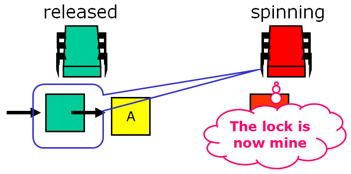

Here's the code for this lock:

.. code-block:: java
	:linenos:

	public class TOLock implements Lock {
		static Qnode AVAILABLE = new Qnode(); //Distinguished node to signify free lock
		AtomicReference<Qnode> tail; //Tail of the queue
		ThreadLocal<Qnode> myNode; //Remember my node…
	}

And the lock function looks like this:

.. code-block:: java
	:linenos:
	:emphasize-lines: 2-4

	public boolean lock(long timeout) {
		Qnode qnode = new Qnode();
		myNode.set(qnode);
		qnode.prev = null;
		//first three lines create and initialize node
		Qnode myPred = tail.getAndSet(qnode); //Swap with tail
		if (myPred== null || myPred.prev == AVAILABLE)
			return true; //If predecessor absent or released, we are done
		long start = now();
		while (now()- start < timeout) { //Keep trying for a while...
			Qnode predPred = myPred.prev; //Spin on predecessor’s prev field
			if (predPred == AVAILABLE) { //Predecessor released lock
				return true;
			} else if (predPred != null) {
      			myPred = predPred; //Predecessor aborted, advance one
    		}
  		}
		if (!tail.compareAndSet(qnode, myPred))
    		qnode.prev = myPred; //Do I have a successor? If CAS fails: I do have a successor, tell it about myPred (see note below)
		return false; //If CAS succeeds: no successor, simply return false. Redirecting to predecessor tells the successors that node belongs to aborted lock() request and that they must spin on its predecessor. 

	}

Note: In case a node is timing out it first checks if tail points to its node, if the CAS is putting back the original value, or the next value in line if you have followed any aborted nodes (i.e., the original node you were spinning on aborted, so you moved to the next in line). If the CAS fails to put back in tail the original node, then someone arrived after you, so you mark your ``prev`` pointer to the prior previous owner. If someone is spinning on your node, they will see the pointer change and follow that chain.

The unlock function looks like this: try to swap back in Null to the tail. If it succeeds, then you are done. Otherwise, you need to set the available to`` prev``\ . This change of ``prev`` signals anyone spinning on your node that they have the lock. If the ``CAS()`` fails, the condition is true, there is a successor and so I must notify it what to wait on since I am timing out. If the tail points to me, then no one is waiting and putting a null completes the ``unlock()``\ .

.. code-block:: java
	:linenos:

	public void unlock() {
		Qnode qnode = myNode.get();
		if (!tail.compareAndSet(qnode, null)) //If CAS failed: exists a successor, notify successor it can enter; if CAS successful: set tail to null, no clean up since no successor waiting
			qnode.prev = AVAILABLE;
	}

Conclusion
##########

In this module we saw a variety of spin locks that vary in characteristics and performance. Such a variety is useful, because no single algorithm is ideal for all applications. For some applications, complex algorithms work best, and for others, simple algorithms are preferable. The best choice usually depends on specific aspects of the application and the target architecture.

.. _real-time systems: http://en.wikipedia.org/wiki/Real-time_computing